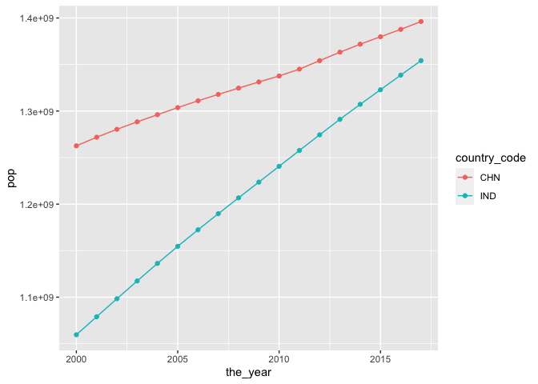
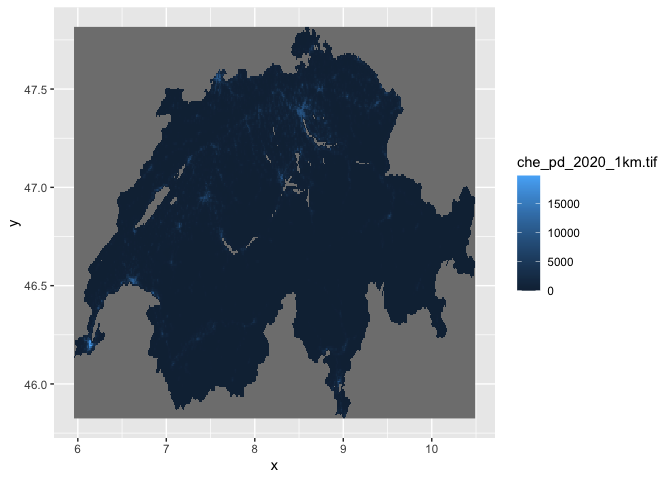
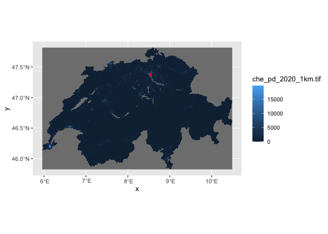
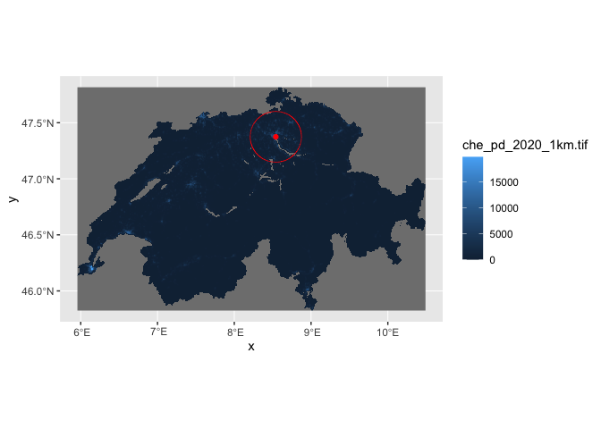
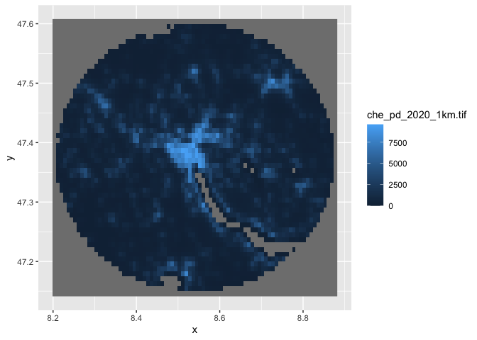
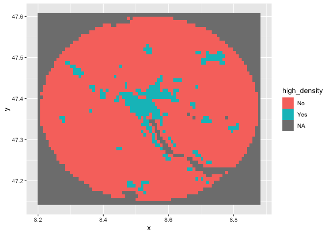
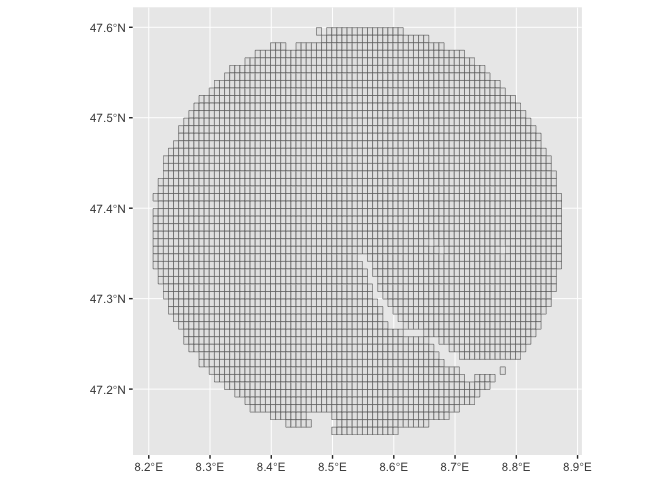

Ten Things I Love About R
================

- <a href="#housekeeping" id="toc-housekeeping">Housekeeping</a>
- <a href="#the-ten-things" id="toc-the-ten-things">The Ten Things</a>
  - <a href="#the-tidyverse" id="toc-the-tidyverse">The tidyverse</a>
- <a href="#import-data" id="toc-import-data">Import Data</a>
  - <a href="#fs" id="toc-fs">FS</a>
  - <a href="#clean-column-names" id="toc-clean-column-names">Clean column
    names</a>
  - <a href="#work-with-dates" id="toc-work-with-dates">Work with dates</a>
  - <a href="#interact-with-databases"
    id="toc-interact-with-databases">Interact with databases</a>
  - <a href="#wrangling-data" id="toc-wrangling-data">Wrangling data</a>
  - <a href="#pivot-data" id="toc-pivot-data">Pivot Data</a>
  - <a href="#easy-charting" id="toc-easy-charting">Easy charting</a>
  - <a href="#do-gis-stuff" id="toc-do-gis-stuff">Do GIS stuff</a>

# Housekeeping

The code below installs the packages you need. To use it, just remove
the \# and hit run.

``` r
#install.packages(tidyverse)
#install.packages("fs")
#install.packages("janitor")
#install.packages("RPostgres")
#install.packages("stars")
#install.packages("sf")
```

# The Ten Things

## The tidyverse

When I first started using R, there was no
[tidyverse](https://www.tidyverse.org). There was just base R, which
caused me heartburn.

But the tidyverse changed all that. It makes using R a breeze.

The tidyverse has packages for [reading
data](https://readr.tidyverse.org), [manipulating
data](https://dplyr.tidyverse.org), [cleaning
data](https://tidyr.tidyverse.org) and many other things. You can [see
them here](https://www.tidyverse.org/packages/).

You can load all the packages at once:

``` r
library(tidyverse)
```

    ── Attaching packages ─────────────────────────────────────── tidyverse 1.3.2 ──
    ✔ ggplot2 3.4.1     ✔ purrr   1.0.1
    ✔ tibble  3.1.8     ✔ dplyr   1.1.0
    ✔ tidyr   1.3.0     ✔ stringr 1.5.0
    ✔ readr   2.1.4     ✔ forcats 1.0.0
    ── Conflicts ────────────────────────────────────────── tidyverse_conflicts() ──
    ✖ dplyr::filter() masks stats::filter()
    ✖ dplyr::lag()    masks stats::lag()

The people behind the tidyverse believe in what they call tidy data.
It’s a concept we use every single day.

Each column is a variable. Each record is an observation. Every cell is
a single value.

Those concepts flow through other packages not in the tidyverse, but
adhere to tidy data principles.

For example, [sf](https://r-spatial.github.io/sf/) is a GIS package that
adheres to tidy principles, which you’ll see below. For rasters, there’s
[stars](https://r-spatial.github.io/stars/) package that’s meant for
spatio-temporal arrays.

For machine learning/modelling, there’s
[tidymodels](https://www.tidymodels.org).

# Import Data

Importing data is a pain in the butt. I think R makes some of those
tasks easier.

You can deal with lots of

For example, if I need to get data into Postgres or SQL Server, I’ll use
R as an intermediary.

I can use the tidyverse’s [readr](https://readr.tidyverse.org).

``` r
single_dataset <- read_csv("./data/importing/abw.csv")
```

    Rows: 4 Columns: 19
    ── Column specification ────────────────────────────────────────────────────────
    Delimiter: ","
    chr  (1): indicator
    dbl (18): 2000, 2001, 2002, 2003, 2004, 2005, 2006, 2007, 2008, 2009, 2010, ...

    ℹ Use `spec()` to retrieve the full column specification for this data.
    ℹ Specify the column types or set `show_col_types = FALSE` to quiet this message.

``` r
single_dataset
```

    # A tibble: 4 × 19
      indic…¹ `2000`  `2001`  `2002`  `2003`  `2004`  `2005`  `2006`  `2007`  `2008`
      <chr>    <dbl>   <dbl>   <dbl>   <dbl>   <dbl>   <dbl>   <dbl>   <dbl>   <dbl>
    1 SP.URB… 4.16e4 4.20e+4 4.22e+4 4.23e+4 4.23e+4 4.24e+4 4.26e+4 4.27e+4 4.29e+4
    2 SP.URB… 1.66e0 9.56e-1 4.01e-1 1.97e-1 9.46e-2 1.94e-1 3.67e-1 4.08e-1 4.13e-1
    3 SP.POP… 8.91e4 9.07e+4 9.18e+4 9.27e+4 9.35e+4 9.45e+4 9.56e+4 9.68e+4 9.80e+4
    4 SP.POP… 2.54e0 1.77e+0 1.19e+0 9.97e-1 9.01e-1 1.00e+0 1.18e+0 1.23e+0 1.24e+0
    # … with 9 more variables: `2009` <dbl>, `2010` <dbl>, `2011` <dbl>,
    #   `2012` <dbl>, `2013` <dbl>, `2014` <dbl>, `2015` <dbl>, `2016` <dbl>,
    #   `2017` <dbl>, and abbreviated variable name ¹​indicator

You’ll see there are other [readr
functions](https://readr.tidyverse.org/reference/index.html) to help you
import data.

Sidenote: Have a SAS, SPSS or Stata dataset? You can import it with
[haven](https://haven.tidyverse.org).

One thing I like to do is import everything as character, then later
convert to appropriate data types. I can do that easily with
[read_csv](https://readr.tidyverse.org/reference/read_delim.html).

``` r
single_dataset <- read_csv("./data/importing/abw.csv", col_types = cols(.default = "c"))
```

## FS

OK. Say you have a directory of files. You want to import them all into
a single dataset.

There’s a tidy-friendly package called [fs](https://fs.r-lib.org) for
working with file systems.

Let’s initialize fs.

``` r
library(fs)
```

What’s in our directory? Annoyingly, there’s a different file for every
country. What to do?

``` r
dir_ls(path="./data/importing")
```

    ./data/importing/ABW.csv ./data/importing/AFE.csv ./data/importing/AFG.csv 
    ./data/importing/AFW.csv ./data/importing/AGO.csv ./data/importing/ALB.csv 
    ./data/importing/AND.csv ./data/importing/ARB.csv ./data/importing/ARE.csv 
    ./data/importing/ARG.csv ./data/importing/ARM.csv ./data/importing/ASM.csv 
    ./data/importing/ATG.csv ./data/importing/AUS.csv ./data/importing/AUT.csv 
    ./data/importing/AZE.csv ./data/importing/BDI.csv ./data/importing/BEL.csv 
    ./data/importing/BEN.csv ./data/importing/BFA.csv ./data/importing/BGD.csv 
    ./data/importing/BGR.csv ./data/importing/BHR.csv ./data/importing/BHS.csv 
    ./data/importing/BIH.csv ./data/importing/BLR.csv ./data/importing/BLZ.csv 
    ./data/importing/BMU.csv ./data/importing/BOL.csv ./data/importing/BRA.csv 
    ./data/importing/BRB.csv ./data/importing/BRN.csv ./data/importing/BTN.csv 
    ./data/importing/BWA.csv ./data/importing/CAF.csv ./data/importing/CAN.csv 
    ./data/importing/CEB.csv ./data/importing/CHE.csv ./data/importing/CHI.csv 
    ./data/importing/CHL.csv ./data/importing/CHN.csv ./data/importing/CIV.csv 
    ./data/importing/CMR.csv ./data/importing/COD.csv ./data/importing/COG.csv 
    ./data/importing/COL.csv ./data/importing/COM.csv ./data/importing/CPV.csv 
    ./data/importing/CRI.csv ./data/importing/CSS.csv ./data/importing/CUB.csv 
    ./data/importing/CUW.csv ./data/importing/CYM.csv ./data/importing/CYP.csv 
    ./data/importing/CZE.csv ./data/importing/DEU.csv ./data/importing/DJI.csv 
    ./data/importing/DMA.csv ./data/importing/DNK.csv ./data/importing/DOM.csv 
    ./data/importing/DZA.csv ./data/importing/EAP.csv ./data/importing/EAR.csv 
    ./data/importing/EAS.csv ./data/importing/ECA.csv ./data/importing/ECS.csv 
    ./data/importing/ECU.csv ./data/importing/EGY.csv ./data/importing/EMU.csv 
    ./data/importing/ERI.csv ./data/importing/ESP.csv ./data/importing/EST.csv 
    ./data/importing/ETH.csv ./data/importing/EUU.csv ./data/importing/FCS.csv 
    ./data/importing/FIN.csv ./data/importing/FJI.csv ./data/importing/FRA.csv 
    ./data/importing/FRO.csv ./data/importing/FSM.csv ./data/importing/GAB.csv 
    ./data/importing/GBR.csv ./data/importing/GEO.csv ./data/importing/GHA.csv 
    ./data/importing/GIB.csv ./data/importing/GIN.csv ./data/importing/GMB.csv 
    ./data/importing/GNB.csv ./data/importing/GNQ.csv ./data/importing/GRC.csv 
    ./data/importing/GRD.csv ./data/importing/GRL.csv ./data/importing/GTM.csv 
    ./data/importing/GUM.csv ./data/importing/GUY.csv ./data/importing/HIC.csv 
    ./data/importing/HKG.csv ./data/importing/HND.csv ./data/importing/HPC.csv 
    ./data/importing/HRV.csv ./data/importing/HTI.csv ./data/importing/HUN.csv 
    ./data/importing/IBD.csv ./data/importing/IBT.csv ./data/importing/IDA.csv 
    ./data/importing/IDB.csv ./data/importing/IDN.csv ./data/importing/IDX.csv 
    ./data/importing/IMN.csv ./data/importing/IND.csv ./data/importing/INX.csv 
    ./data/importing/IRL.csv ./data/importing/IRN.csv ./data/importing/IRQ.csv 
    ./data/importing/ISL.csv ./data/importing/ISR.csv ./data/importing/ITA.csv 
    ./data/importing/JAM.csv ./data/importing/JOR.csv ./data/importing/JPN.csv 
    ./data/importing/KAZ.csv ./data/importing/KEN.csv ./data/importing/KGZ.csv 
    ./data/importing/KHM.csv ./data/importing/KIR.csv ./data/importing/KNA.csv 
    ./data/importing/KOR.csv ./data/importing/KWT.csv ./data/importing/LAC.csv 
    ./data/importing/LAO.csv ./data/importing/LBN.csv ./data/importing/LBR.csv 
    ./data/importing/LBY.csv ./data/importing/LCA.csv ./data/importing/LCN.csv 
    ./data/importing/LDC.csv ./data/importing/LIC.csv ./data/importing/LIE.csv 
    ./data/importing/LKA.csv ./data/importing/LMC.csv ./data/importing/LMY.csv 
    ./data/importing/LSO.csv ./data/importing/LTE.csv ./data/importing/LTU.csv 
    ./data/importing/LUX.csv ./data/importing/LVA.csv ./data/importing/MAC.csv 
    ./data/importing/MAF.csv ./data/importing/MAR.csv ./data/importing/MCO.csv 
    ./data/importing/MDA.csv ./data/importing/MDG.csv ./data/importing/MDV.csv 
    ./data/importing/MEA.csv ./data/importing/MEX.csv ./data/importing/MHL.csv 
    ./data/importing/MIC.csv ./data/importing/MKD.csv ./data/importing/MLI.csv 
    ./data/importing/MLT.csv ./data/importing/MMR.csv ./data/importing/MNA.csv 
    ./data/importing/MNE.csv ./data/importing/MNG.csv ./data/importing/MNP.csv 
    ./data/importing/MOZ.csv ./data/importing/MRT.csv ./data/importing/MUS.csv 
    ./data/importing/MWI.csv ./data/importing/MYS.csv ./data/importing/NAC.csv 
    ./data/importing/NAM.csv ./data/importing/NCL.csv ./data/importing/NER.csv 
    ./data/importing/NGA.csv ./data/importing/NIC.csv ./data/importing/NLD.csv 
    ./data/importing/NOR.csv ./data/importing/NPL.csv ./data/importing/NRU.csv 
    ./data/importing/NZL.csv ./data/importing/OED.csv ./data/importing/OMN.csv 
    ./data/importing/OSS.csv ./data/importing/PAK.csv ./data/importing/PAN.csv 
    ./data/importing/PER.csv ./data/importing/PHL.csv ./data/importing/PLW.csv 
    ./data/importing/PNG.csv ./data/importing/POL.csv ./data/importing/PRE.csv 
    ./data/importing/PRI.csv ./data/importing/PRK.csv ./data/importing/PRT.csv 
    ./data/importing/PRY.csv ./data/importing/PSE.csv ./data/importing/PSS.csv 
    ./data/importing/PST.csv ./data/importing/PYF.csv ./data/importing/QAT.csv 
    ./data/importing/ROU.csv ./data/importing/RUS.csv ./data/importing/RWA.csv 
    ./data/importing/SAS.csv ./data/importing/SAU.csv ./data/importing/SDN.csv 
    ./data/importing/SEN.csv ./data/importing/SGP.csv ./data/importing/SLB.csv 
    ./data/importing/SLE.csv ./data/importing/SLV.csv ./data/importing/SMR.csv 
    ./data/importing/SOM.csv ./data/importing/SRB.csv ./data/importing/SSA.csv 
    ./data/importing/SSD.csv ./data/importing/SSF.csv ./data/importing/SST.csv 
    ./data/importing/STP.csv ./data/importing/SUR.csv ./data/importing/SVK.csv 
    ./data/importing/SVN.csv ./data/importing/SWE.csv ./data/importing/SWZ.csv 
    ./data/importing/SXM.csv ./data/importing/SYC.csv ./data/importing/SYR.csv 
    ./data/importing/TCA.csv ./data/importing/TCD.csv ./data/importing/TEA.csv 
    ./data/importing/TEC.csv ./data/importing/TGO.csv ./data/importing/THA.csv 
    ./data/importing/TJK.csv ./data/importing/TKM.csv ./data/importing/TLA.csv 
    ./data/importing/TLS.csv ./data/importing/TMN.csv ./data/importing/TON.csv 
    ./data/importing/TSA.csv ./data/importing/TSS.csv ./data/importing/TTO.csv 
    ./data/importing/TUN.csv ./data/importing/TUR.csv ./data/importing/TUV.csv 
    ./data/importing/TZA.csv ./data/importing/UGA.csv ./data/importing/UKR.csv 
    ./data/importing/UMC.csv ./data/importing/URY.csv ./data/importing/USA.csv 
    ./data/importing/UZB.csv ./data/importing/VCT.csv ./data/importing/VEN.csv 
    ./data/importing/VGB.csv ./data/importing/VIR.csv ./data/importing/VNM.csv 
    ./data/importing/VUT.csv ./data/importing/WLD.csv ./data/importing/WSM.csv 
    ./data/importing/XKX.csv ./data/importing/YEM.csv ./data/importing/ZAF.csv 
    ./data/importing/ZMB.csv ./data/importing/ZWE.csv 

fs makes it easy.

``` r
imported_data_collection <- dir_ls(path="./data/importing") %>%
  map_df(read_csv, .id = "file", col_types = cols(.default = "c")) # map applies a function to each record...so if each filename from dir_ls is a record, this applies read_csv to each record. 

imported_data_collection
```

    # A tibble: 1,064 × 20
       file   indic…¹ `2000` `2001` `2002` `2003` `2004` `2005` `2006` `2007` `2008`
       <chr>  <chr>   <chr>  <chr>  <chr>  <chr>  <chr>  <chr>  <chr>  <chr>  <chr> 
     1 ./dat… SP.URB… 41625  42025  42194  42277  42317  42399  42555  42729  42906 
     2 ./dat… SP.URB… 1.664… 0.956… 0.401… 0.196… 0.094… 0.193… 0.367… 0.408… 0.413…
     3 ./dat… SP.POP… 89101  90691  91781  92701  93540  94483  95606  96787  97996 
     4 ./dat… SP.POP… 2.539… 1.768… 1.194… 0.997… 0.900… 1.003… 1.181… 1.227… 1.241…
     5 ./dat… SP.URB… 11555… 11977… 12422… 12883… 13364… 13874… 14402… 14923… 15538…
     6 ./dat… SP.URB… 3.602… 3.655… 3.716… 3.708… 3.736… 3.814… 3.806… 3.613… 4.122…
     7 ./dat… SP.POP… 40160… 41200… 42274… 43380… 44528… 45715… 46950… 48240… 49574…
     8 ./dat… SP.POP… 2.583… 2.589… 2.606… 2.617… 2.644… 2.666… 2.702… 2.747… 2.765…
     9 ./dat… SP.URB… 43147… 43647… 46748… 50618… 52995… 55420… 58282… 59870… 61628…
    10 ./dat… SP.URB… 1.861… 1.153… 6.863… 7.953… 4.588… 4.474… 5.034… 2.688… 2.893…
    # … with 1,054 more rows, 9 more variables: `2009` <chr>, `2010` <chr>,
    #   `2011` <chr>, `2012` <chr>, `2013` <chr>, `2014` <chr>, `2015` <chr>,
    #   `2016` <chr>, `2017` <chr>, and abbreviated variable name ¹​indicator

And, take note how it also includes the filename from which that data
originated. Useful.

## Clean column names

I use a single function from the [janitor
package](https://sfirke.github.io/janitor/index.html). More precisely: I
use
[clean_names](https://sfirke.github.io/janitor/reference/clean_names.html)
constantly.

The data we just imported gives us a perfect use case. Here are our ugly
column names. Column names starting with numbers? Unacceptable.

``` r
colnames(imported_data_collection)
```

     [1] "file"      "indicator" "2000"      "2001"      "2002"      "2003"     
     [7] "2004"      "2005"      "2006"      "2007"      "2008"      "2009"     
    [13] "2010"      "2011"      "2012"      "2013"      "2014"      "2015"     
    [19] "2016"      "2017"     

Yuck. But we can use clean_names:

``` r
imported_data_collection_fixed <- imported_data_collection %>%
  janitor::clean_names() # Notice here that I used the library name and function name. You can do this if you don't want to load the entire package into memory. 

imported_data_collection_fixed
```

    # A tibble: 1,064 × 20
       file      indic…¹ x2000 x2001 x2002 x2003 x2004 x2005 x2006 x2007 x2008 x2009
       <chr>     <chr>   <chr> <chr> <chr> <chr> <chr> <chr> <chr> <chr> <chr> <chr>
     1 ./data/i… SP.URB… 41625 42025 42194 42277 42317 42399 42555 42729 42906 43079
     2 ./data/i… SP.URB… 1.66… 0.95… 0.40… 0.19… 0.09… 0.19… 0.36… 0.40… 0.41… 0.40…
     3 ./data/i… SP.POP… 89101 90691 91781 92701 93540 94483 95606 96787 97996 99212
     4 ./data/i… SP.POP… 2.53… 1.76… 1.19… 0.99… 0.90… 1.00… 1.18… 1.22… 1.24… 1.23…
     5 ./data/i… SP.URB… 1155… 1197… 1242… 1288… 1336… 1387… 1440… 1492… 1553… 1617…
     6 ./data/i… SP.URB… 3.60… 3.65… 3.71… 3.70… 3.73… 3.81… 3.80… 3.61… 4.12… 4.11…
     7 ./data/i… SP.POP… 4016… 4120… 4227… 4338… 4452… 4571… 4695… 4824… 4957… 5094…
     8 ./data/i… SP.POP… 2.58… 2.58… 2.60… 2.61… 2.64… 2.66… 2.70… 2.74… 2.76… 2.75…
     9 ./data/i… SP.URB… 4314… 4364… 4674… 5061… 5299… 5542… 5828… 5987… 6162… 6443…
    10 ./data/i… SP.URB… 1.86… 1.15… 6.86… 7.95… 4.58… 4.47… 5.03… 2.68… 2.89… 4.44…
    # … with 1,054 more rows, 8 more variables: x2010 <chr>, x2011 <chr>,
    #   x2012 <chr>, x2013 <chr>, x2014 <chr>, x2015 <chr>, x2016 <chr>,
    #   x2017 <chr>, and abbreviated variable name ¹​indicator

## Work with dates

``` r
library(nycflights13)
library(lubridate)
```


    Attaching package: 'lubridate'

    The following objects are masked from 'package:base':

        date, intersect, setdiff, union

We can use lubridate to do some nice things.

``` r
flights %>% 
  select(year, month, day, hour, minute) %>% 
  mutate(departure = make_datetime(year, month, day, hour, minute))
```

    # A tibble: 336,776 × 6
        year month   day  hour minute departure          
       <int> <int> <int> <dbl>  <dbl> <dttm>             
     1  2013     1     1     5     15 2013-01-01 05:15:00
     2  2013     1     1     5     29 2013-01-01 05:29:00
     3  2013     1     1     5     40 2013-01-01 05:40:00
     4  2013     1     1     5     45 2013-01-01 05:45:00
     5  2013     1     1     6      0 2013-01-01 06:00:00
     6  2013     1     1     5     58 2013-01-01 05:58:00
     7  2013     1     1     6      0 2013-01-01 06:00:00
     8  2013     1     1     6      0 2013-01-01 06:00:00
     9  2013     1     1     6      0 2013-01-01 06:00:00
    10  2013     1     1     6      0 2013-01-01 06:00:00
    # … with 336,766 more rows

We can easily extract elements of the date.

``` r
flights %>% 
  select(year, month, day, hour, minute) %>% 
  mutate(departure = make_datetime(year, month, day, hour, minute)) %>%
  select(departure) %>%
  mutate(the_year = year(departure),
         the_day = day(departure))
```

    # A tibble: 336,776 × 3
       departure           the_year the_day
       <dttm>                 <dbl>   <int>
     1 2013-01-01 05:15:00     2013       1
     2 2013-01-01 05:29:00     2013       1
     3 2013-01-01 05:40:00     2013       1
     4 2013-01-01 05:45:00     2013       1
     5 2013-01-01 06:00:00     2013       1
     6 2013-01-01 05:58:00     2013       1
     7 2013-01-01 06:00:00     2013       1
     8 2013-01-01 06:00:00     2013       1
     9 2013-01-01 06:00:00     2013       1
    10 2013-01-01 06:00:00     2013       1
    # … with 336,766 more rows

And then we can do all kinds of things with differences in times.

``` r
make_datetime_100 <- function(year, month, day, time) {
  make_datetime(year, month, day, time %/% 100, time %% 100)
}

flights_dt <- flights %>% 
  filter(!is.na(dep_time), !is.na(arr_time)) %>% 
  mutate(
    dep_time = make_datetime_100(year, month, day, dep_time),
    arr_time = make_datetime_100(year, month, day, arr_time),
    sched_dep_time = make_datetime_100(year, month, day, sched_dep_time),
    sched_arr_time = make_datetime_100(year, month, day, sched_arr_time)
  ) %>% 
  select(origin, dest, ends_with("delay"), ends_with("time"))

flights_dt
```

    # A tibble: 328,063 × 9
       origin dest  dep_delay arr_delay dep_time            sched_dep_time     
       <chr>  <chr>     <dbl>     <dbl> <dttm>              <dttm>             
     1 EWR    IAH           2        11 2013-01-01 05:17:00 2013-01-01 05:15:00
     2 LGA    IAH           4        20 2013-01-01 05:33:00 2013-01-01 05:29:00
     3 JFK    MIA           2        33 2013-01-01 05:42:00 2013-01-01 05:40:00
     4 JFK    BQN          -1       -18 2013-01-01 05:44:00 2013-01-01 05:45:00
     5 LGA    ATL          -6       -25 2013-01-01 05:54:00 2013-01-01 06:00:00
     6 EWR    ORD          -4        12 2013-01-01 05:54:00 2013-01-01 05:58:00
     7 EWR    FLL          -5        19 2013-01-01 05:55:00 2013-01-01 06:00:00
     8 LGA    IAD          -3       -14 2013-01-01 05:57:00 2013-01-01 06:00:00
     9 JFK    MCO          -3        -8 2013-01-01 05:57:00 2013-01-01 06:00:00
    10 LGA    ORD          -2         8 2013-01-01 05:58:00 2013-01-01 06:00:00
    # … with 328,053 more rows, and 3 more variables: arr_time <dttm>,
    #   sched_arr_time <dttm>, air_time <dbl>

You can do simple date comparisons.

``` r
flights_dt %>% 
  mutate(late_departure = difftime(ymd_hms(sched_dep_time), ymd_hms(dep_time), units="secs"))
```

    # A tibble: 328,063 × 10
       origin dest  dep_delay arr_delay dep_time            sched_dep_time     
       <chr>  <chr>     <dbl>     <dbl> <dttm>              <dttm>             
     1 EWR    IAH           2        11 2013-01-01 05:17:00 2013-01-01 05:15:00
     2 LGA    IAH           4        20 2013-01-01 05:33:00 2013-01-01 05:29:00
     3 JFK    MIA           2        33 2013-01-01 05:42:00 2013-01-01 05:40:00
     4 JFK    BQN          -1       -18 2013-01-01 05:44:00 2013-01-01 05:45:00
     5 LGA    ATL          -6       -25 2013-01-01 05:54:00 2013-01-01 06:00:00
     6 EWR    ORD          -4        12 2013-01-01 05:54:00 2013-01-01 05:58:00
     7 EWR    FLL          -5        19 2013-01-01 05:55:00 2013-01-01 06:00:00
     8 LGA    IAD          -3       -14 2013-01-01 05:57:00 2013-01-01 06:00:00
     9 JFK    MCO          -3        -8 2013-01-01 05:57:00 2013-01-01 06:00:00
    10 LGA    ORD          -2         8 2013-01-01 05:58:00 2013-01-01 06:00:00
    # … with 328,053 more rows, and 4 more variables: arr_time <dttm>,
    #   sched_arr_time <dttm>, air_time <dbl>, late_departure <drtn>

## Interact with databases

OK. I’ve imported my data and I want to send it to Postgres.

[RPostgres](https://rpostgres.r-dbi.org) makes that easy.

To connect with the DB, you first need to set up a little connection
string to the DB. If you’ve ever used ODBC, it’s kinda similar to that
process.

Here’s one for a local Postgres install. Notice I used the
askForPassword function. That’s so I don’t encode my username and
password when I plan to upload this to Github.

Yes, I know I should use rstudioapi::askForPassword(“Database password”)
in place of user and password. But the Quarto document won’t load, so we
use this generic connection to a local DB.

``` r
library(RPostgres)

con <- dbConnect(RPostgres::Postgres(),
                 dbname = 'test2', 
                 host = "localhost", 
                 port = 5432, 
                 user = "rstudio", 
                 password = "baseball1"
)
```

From here, you can do [all kinds of
things](https://rpostgres.r-dbi.org/reference/index.html).

Want to send our dataset to the DB?

``` r
dbWriteTable(con, "my_table_name", imported_data_collection_fixed, overwrite=TRUE)
```

Want to read it back?

``` r
showing_off <- dbReadTable(con, "my_table_name")

glimpse(showing_off)
```

    Rows: 1,064
    Columns: 20
    $ file      <chr> "./data/importing/ABW.csv", "./data/importing/ABW.csv", "./d…
    $ indicator <chr> "SP.URB.TOTL", "SP.URB.GROW", "SP.POP.TOTL", "SP.POP.GROW", …
    $ x2000     <chr> "41625", "1.66422212392663", "89101", "2.53923444445246", "1…
    $ x2001     <chr> "42025", "0.956373099407145", "90691", "1.76875662143885", "…
    $ x2002     <chr> "42194", "0.401335154395215", "91781", "1.19471805545637", "…
    $ x2003     <chr> "42277", "0.196517211141057", "92701", "0.997395547284924", …
    $ x2004     <chr> "42317", "0.0945693618486456", "93540", "0.900989229759957",…
    $ x2005     <chr> "42399", "0.193588048559493", "94483", "1.00307718391638", "…
    $ x2006     <chr> "42555", "0.367257987480091", "95606", "1.18156554573069", "…
    $ x2007     <chr> "42729", "0.408048969163451", "96787", "1.22771081489399", "…
    $ x2008     <chr> "42906", "0.413382967375507", "97996", "1.24139737678817", "…
    $ x2009     <chr> "43079", "0.402396309678717", "99212", "1.23323132057229", "…
    $ x2010     <chr> "43206", "0.294373510368369", "100341", "1.13154104048985", …
    $ x2011     <chr> "43493", "0.662063111068539", "101288", "0.939355909629835",…
    $ x2012     <chr> "43864", "0.849393249627712", "102112", "0.810230587788097",…
    $ x2013     <chr> "44228", "0.826413457840807", "102880", "0.749301039347625",…
    $ x2014     <chr> "44588", "0.810669184722173", "103594", "0.691615260101675",…
    $ x2015     <chr> "44943", "0.793025567597756", "104257", "0.63795916173479", …
    $ x2016     <chr> "45297", "0.784578492708788", "104874", "0.590062487333077",…
    $ x2017     <chr> "45648", "0.771898934070187", "105439", "0.537295706145068",…

What if you want to write your own SQL?

You can do it a couple ways.

``` r
# first way
showing_off <- dbGetQuery(con, "select indicator, x2000 from my_table_name")

glimpse(showing_off)
```

    Rows: 1,064
    Columns: 2
    $ indicator <chr> "SP.URB.TOTL", "SP.URB.GROW", "SP.POP.TOTL", "SP.POP.GROW", …
    $ x2000     <chr> "41625", "1.66422212392663", "89101", "2.53923444445246", "1…

Second way.

``` r
results <- dbSendQuery(con, "select indicator, x2000 from my_table_name")
results_back <- dbFetch(results, n=10)

results_back
```

         indicator            x2000
    1  SP.URB.TOTL            41625
    2  SP.URB.GROW 1.66422212392663
    3  SP.POP.TOTL            89101
    4  SP.POP.GROW 2.53923444445246
    5  SP.URB.TOTL        115551653
    6  SP.URB.GROW 3.60226233978761
    7  SP.POP.TOTL        401600588
    8  SP.POP.GROW  2.5835792421522
    9  SP.URB.TOTL          4314700
    10 SP.URB.GROW 1.86137729962901

But wait. There’s more. Entering the chat now is
[dbplyr](https://dbplyr.tidyverse.org), which uses dplyr verbs to
interact with a database. Sweet.

``` r
library(dbplyr)
```


    Attaching package: 'dbplyr'

    The following objects are masked from 'package:dplyr':

        ident, sql

Now say you want to interact with a particular table.

First create a connection to that table like so:

``` r
my_dbplyr_connection <- tbl(con, "my_table_name")
```

    Warning in result_create(conn@ptr, statement, immediate): Closing open result
    set, cancelling previous query

``` r
my_dbplyr_connection
```

    # Source:   table<my_table_name> [?? x 20]
    # Database: postgres  [rstudio@localhost:5432/test2]
       file      indic…¹ x2000 x2001 x2002 x2003 x2004 x2005 x2006 x2007 x2008 x2009
       <chr>     <chr>   <chr> <chr> <chr> <chr> <chr> <chr> <chr> <chr> <chr> <chr>
     1 ./data/i… SP.URB… 41625 42025 42194 42277 42317 42399 42555 42729 42906 43079
     2 ./data/i… SP.URB… 1.66… 0.95… 0.40… 0.19… 0.09… 0.19… 0.36… 0.40… 0.41… 0.40…
     3 ./data/i… SP.POP… 89101 90691 91781 92701 93540 94483 95606 96787 97996 99212
     4 ./data/i… SP.POP… 2.53… 1.76… 1.19… 0.99… 0.90… 1.00… 1.18… 1.22… 1.24… 1.23…
     5 ./data/i… SP.URB… 1155… 1197… 1242… 1288… 1336… 1387… 1440… 1492… 1553… 1617…
     6 ./data/i… SP.URB… 3.60… 3.65… 3.71… 3.70… 3.73… 3.81… 3.80… 3.61… 4.12… 4.11…
     7 ./data/i… SP.POP… 4016… 4120… 4227… 4338… 4452… 4571… 4695… 4824… 4957… 5094…
     8 ./data/i… SP.POP… 2.58… 2.58… 2.60… 2.61… 2.64… 2.66… 2.70… 2.74… 2.76… 2.75…
     9 ./data/i… SP.URB… 4314… 4364… 4674… 5061… 5299… 5542… 5828… 5987… 6162… 6443…
    10 ./data/i… SP.URB… 1.86… 1.15… 6.86… 7.95… 4.58… 4.47… 5.03… 2.68… 2.89… 4.44…
    # … with more rows, 8 more variables: x2010 <chr>, x2011 <chr>, x2012 <chr>,
    #   x2013 <chr>, x2014 <chr>, x2015 <chr>, x2016 <chr>, x2017 <chr>, and
    #   abbreviated variable name ¹​indicator

To me, one of the real time-saving features of dbplyr is how it makes
select statements much easier.

Say you just want to extract the total population for each year— you can
use
[tidyselectors](https://tidyselect.r-lib.org/reference/language.html)
that make it easier than writing a traditional select statement in SQL.

``` r
my_dbplyr_connection %>%
  filter(indicator=="SP.POP.TOTL") %>%
  select(file, starts_with("x2")) # saves me writing out all those field names in a select statement
```

    # Source:   SQL [?? x 19]
    # Database: postgres  [rstudio@localhost:5432/test2]
       file  x2000 x2001 x2002 x2003 x2004 x2005 x2006 x2007 x2008 x2009 x2010 x2011
       <chr> <chr> <chr> <chr> <chr> <chr> <chr> <chr> <chr> <chr> <chr> <chr> <chr>
     1 ./da… 89101 90691 91781 92701 93540 94483 95606 96787 97996 99212 1003… 1012…
     2 ./da… 4016… 4120… 4227… 4338… 4452… 4571… 4695… 4824… 4957… 5094… 5234… 5377…
     3 ./da… 1954… 1968… 2100… 2264… 2355… 2441… 2544… 2590… 2642… 2738… 2818… 2924…
     4 ./da… 2696… 2771… 2849… 2929… 3012… 3098… 3186… 3276… 3368… 3464… 3563… 3664…
     5 ./da… 1639… 1694… 1751… 1812… 1877… 1945… 2016… 2090… 2169… 2250… 2336… 2425…
     6 ./da… 3089… 3060… 3051… 3039… 3026… 3011… 2992… 2970… 2947… 2927… 2913… 2905…
     7 ./da… 66097 67820 70849 73907 76933 79826 80221 78168 76055 73852 71519 70567
     8 ./da… 2870… 2935… 3000… 3065… 3132… 3205… 3287… 3374… 3466… 3557… 3644… 3723…
     9 ./da… 3275… 3454… 3633… 3813… 3993… 4280… 4898… 5872… 6988… 7992… 8481… 8575…
    10 ./da… 3707… 3748… 3788… 3827… 3866… 3907… 3947… 3987… 4027… 4068… 4078… 4126…
    # … with more rows, and 6 more variables: x2012 <chr>, x2013 <chr>,
    #   x2014 <chr>, x2015 <chr>, x2016 <chr>, x2017 <chr>

## Wrangling data

OK. One thing we need to add is extract the ISO3 code of the country
buried in the filename. We can extract those from the file name using
[str_extract](https://stringr.tidyverse.org/reference/str_extract.html)
and [regular
expressions](https://cran.r-project.org/web/packages/stringr/vignettes/regular-expressions.html).

``` r
my_pattern <- "./data/importing/(\\D\\D\\D).csv"

imported_data_collection_fixed_2 <- imported_data_collection_fixed %>%
  filter(indicator=="SP.POP.TOTL") %>%
  mutate(country_code = str_extract(file, my_pattern, group=1)) %>%
  select(file, country_code, starts_with("x2"))

imported_data_collection_fixed_2
```

    # A tibble: 266 × 20
       file      count…¹ x2000 x2001 x2002 x2003 x2004 x2005 x2006 x2007 x2008 x2009
       <chr>     <chr>   <chr> <chr> <chr> <chr> <chr> <chr> <chr> <chr> <chr> <chr>
     1 ./data/i… ABW     89101 90691 91781 92701 93540 94483 95606 96787 97996 99212
     2 ./data/i… AFE     4016… 4120… 4227… 4338… 4452… 4571… 4695… 4824… 4957… 5094…
     3 ./data/i… AFG     1954… 1968… 2100… 2264… 2355… 2441… 2544… 2590… 2642… 2738…
     4 ./data/i… AFW     2696… 2771… 2849… 2929… 3012… 3098… 3186… 3276… 3368… 3464…
     5 ./data/i… AGO     1639… 1694… 1751… 1812… 1877… 1945… 2016… 2090… 2169… 2250…
     6 ./data/i… ALB     3089… 3060… 3051… 3039… 3026… 3011… 2992… 2970… 2947… 2927…
     7 ./data/i… AND     66097 67820 70849 73907 76933 79826 80221 78168 76055 73852
     8 ./data/i… ARB     2870… 2935… 3000… 3065… 3132… 3205… 3287… 3374… 3466… 3557…
     9 ./data/i… ARE     3275… 3454… 3633… 3813… 3993… 4280… 4898… 5872… 6988… 7992…
    10 ./data/i… ARG     3707… 3748… 3788… 3827… 3866… 3907… 3947… 3987… 4027… 4068…
    # … with 256 more rows, 8 more variables: x2010 <chr>, x2011 <chr>,
    #   x2012 <chr>, x2013 <chr>, x2014 <chr>, x2015 <chr>, x2016 <chr>,
    #   x2017 <chr>, and abbreviated variable name ¹​country_code

Cool huh?

## Pivot Data

OK. So remember how we imported all that data as character? We need to
convert all those pop fields to integers.

We could write a mutate statement to do each of the years individually.
Or we could pivot the data, making a wide dataset into a long one.

``` r
imported_data_collection_fixed_2 %>%
  pivot_longer(cols=starts_with("x"), names_to = "the_year", values_to = "pop_tot")
```

    # A tibble: 4,788 × 4
       file                     country_code the_year pop_tot
       <chr>                    <chr>        <chr>    <chr>  
     1 ./data/importing/ABW.csv ABW          x2000    89101  
     2 ./data/importing/ABW.csv ABW          x2001    90691  
     3 ./data/importing/ABW.csv ABW          x2002    91781  
     4 ./data/importing/ABW.csv ABW          x2003    92701  
     5 ./data/importing/ABW.csv ABW          x2004    93540  
     6 ./data/importing/ABW.csv ABW          x2005    94483  
     7 ./data/importing/ABW.csv ABW          x2006    95606  
     8 ./data/importing/ABW.csv ABW          x2007    96787  
     9 ./data/importing/ABW.csv ABW          x2008    97996  
    10 ./data/importing/ABW.csv ABW          x2009    99212  
    # … with 4,778 more rows

So now we can just convert that one field to numeric, then pivot it
back.

``` r
imported_data_collection_fixed_3 <- imported_data_collection_fixed_2 %>%
  pivot_longer(cols=starts_with("x"), names_to = "the_year", values_to = "pop_tot") %>%
  mutate(pop_tot_num = as.numeric(pop_tot)) %>%
  select(!pop_tot) %>% # drop the old character field
  pivot_wider(names_from = the_year, values_from = pop_tot_num)

imported_data_collection_fixed_3
```

    # A tibble: 266 × 20
       file   count…¹  x2000  x2001  x2002  x2003  x2004  x2005  x2006  x2007  x2008
       <chr>  <chr>    <dbl>  <dbl>  <dbl>  <dbl>  <dbl>  <dbl>  <dbl>  <dbl>  <dbl>
     1 ./dat… ABW     8.91e4 9.07e4 9.18e4 9.27e4 9.35e4 9.45e4 9.56e4 9.68e4 9.80e4
     2 ./dat… AFE     4.02e8 4.12e8 4.23e8 4.34e8 4.45e8 4.57e8 4.70e8 4.82e8 4.96e8
     3 ./dat… AFG     1.95e7 1.97e7 2.10e7 2.26e7 2.36e7 2.44e7 2.54e7 2.59e7 2.64e7
     4 ./dat… AFW     2.70e8 2.77e8 2.85e8 2.93e8 3.01e8 3.10e8 3.19e8 3.28e8 3.37e8
     5 ./dat… AGO     1.64e7 1.69e7 1.75e7 1.81e7 1.88e7 1.95e7 2.02e7 2.09e7 2.17e7
     6 ./dat… ALB     3.09e6 3.06e6 3.05e6 3.04e6 3.03e6 3.01e6 2.99e6 2.97e6 2.95e6
     7 ./dat… AND     6.61e4 6.78e4 7.08e4 7.39e4 7.69e4 7.98e4 8.02e4 7.82e4 7.61e4
     8 ./dat… ARB     2.87e8 2.94e8 3.00e8 3.07e8 3.13e8 3.21e8 3.29e8 3.37e8 3.47e8
     9 ./dat… ARE     3.28e6 3.45e6 3.63e6 3.81e6 3.99e6 4.28e6 4.90e6 5.87e6 6.99e6
    10 ./dat… ARG     3.71e7 3.75e7 3.79e7 3.83e7 3.87e7 3.91e7 3.95e7 3.99e7 4.03e7
    # … with 256 more rows, 9 more variables: x2009 <dbl>, x2010 <dbl>,
    #   x2011 <dbl>, x2012 <dbl>, x2013 <dbl>, x2014 <dbl>, x2015 <dbl>,
    #   x2016 <dbl>, x2017 <dbl>, and abbreviated variable name ¹​country_code

Voila!

## Easy charting

So let’s take our last dataset and do some charting. How about we chart
China and India’s population?

We’re going to filter for those two countries, then pivot longer because
it’s a time series, then we’re going to turn our year field name into an
integer.

``` r
ready_to_chart <- imported_data_collection_fixed_3 %>%
  filter(country_code %in% c("IND", "CHN")) %>%
  pivot_longer(cols = starts_with("x"), names_to = "the_year", values_to = "pop") %>%
  mutate(the_year = as.integer(str_remove(the_year, "x")))

ready_to_chart
```

    # A tibble: 36 × 4
       file                     country_code the_year        pop
       <chr>                    <chr>           <int>      <dbl>
     1 ./data/importing/CHN.csv CHN              2000 1262645000
     2 ./data/importing/CHN.csv CHN              2001 1271850000
     3 ./data/importing/CHN.csv CHN              2002 1280400000
     4 ./data/importing/CHN.csv CHN              2003 1288400000
     5 ./data/importing/CHN.csv CHN              2004 1296075000
     6 ./data/importing/CHN.csv CHN              2005 1303720000
     7 ./data/importing/CHN.csv CHN              2006 1311020000
     8 ./data/importing/CHN.csv CHN              2007 1317885000
     9 ./data/importing/CHN.csv CHN              2008 1324655000
    10 ./data/importing/CHN.csv CHN              2009 1331260000
    # … with 26 more rows

``` r
p1 <- ggplot(data=ready_to_chart, aes(x=the_year, y=pop, group=country_code, color=country_code)) + 
  geom_line() +
  geom_point()

p1
```



## Do GIS stuff

OK. So we’ve all traditionally worked with desktop applications, such as
QGIS or ArcGIS.

We can do all of that stuff in R.

For vectors, we can use SF. For rasters, we can use stars.

``` r
library(stars)
```

    Loading required package: abind

    Loading required package: sf

    Linking to GEOS 3.11.0, GDAL 3.5.3, PROJ 9.1.0; sf_use_s2() is TRUE

``` r
library(sf)
```

Let’s say we have a raster of 2020 population density in Switzerland. We
can read it into a stars object like so.

``` r
swiss_raster <- read_stars("./data/che_pd_2020_1km.tif")
```

Let’s take a look.

``` r
ggplot() + 
  geom_stars(data=swiss_raster)
```



Let’s say we wanted to see just the area around Zurich.

One simple way is to use
[tribble](https://tibble.tidyverse.org/reference/tribble.html), which
makes it easy to create an SF point on the fly. Let’s create a dot for
Zurich.

``` r
zurich_dot <- tribble(
  ~site, ~x, ~y,
  "Zurich", 8.541111, 47.374444
  ) %>%
  st_as_sf(coords = c("x", "y"), crs = 4326)
```

Let’s make sure the dot is where the dot is supposed to be — in Zurich.

``` r
ggplot() + 
  geom_stars(data=swiss_raster) +
  geom_sf(data=zurich_dot, color="red")
```



Now we’ve got a dot. Let’s buffer that dot.

``` r
zurich_25k_buffer <- zurich_dot %>%
  st_buffer(25000) # base unit in meters, so 25,000m = 25km
```

Let’s see how it looks.

``` r
ggplot() + 
  geom_stars(data=swiss_raster) +
  geom_sf(data=zurich_dot, color="red") +
  geom_sf(data=zurich_25k_buffer, fill=NA, color="red")
```



Now let’s crop the raster by our buffer.

``` r
swiss_raster_cropped <- swiss_raster %>%
  st_crop(zurich_25k_buffer) 
```

How does it look?

``` r
ggplot() + 
  geom_stars(data=swiss_raster_cropped)
```



I won’t go too far down the rabbit hole, but you can use [tidyverse
methods](https://r-spatial.github.io/stars/articles/stars3.html) with
stars objects.

Here we rename the attribute to pop_density_20, then we create a new
band with a yes or no whether it’s high density. Then we select just our
newly created high_density band.

``` r
new_band_example <- swiss_raster_cropped %>%
  rename(pop_density_20 = 1) %>%
  mutate(high_density = if_else(pop_density_20 > 3000, "Yes", "No")) %>%
  select(high_density) 
```

How does it look?

``` r
ggplot() + 
  geom_stars(data=new_band_example)
```



What if you’re like me and prefer to work in vectors?

Let’s return to our swiss_raster_cropped stars object.

It takes just one line of code to turn this raster into an SF vector
object.

``` r
swiss_raster_cropped_sf <- swiss_raster_cropped %>%
  st_as_sf()
```

Now let’s take a look.

``` r
ggplot() + 
  geom_sf(data=swiss_raster_cropped_sf)
```



What about a spatial filter?

Let’s create another smaller buffer as an example.

``` r
zurich_10k_buffer <- zurich_dot %>%
  st_buffer(10000) 
```

Now we can use st_filter.

``` r
smaller_zurich_area <- swiss_raster_cropped_sf %>%
  st_filter(zurich_10k_buffer)
```

How does it look?

``` r
ggplot() + 
  geom_sf(data=swiss_raster_cropped_sf) +
  geom_sf(data=smaller_zurich_area, color="red")
```


