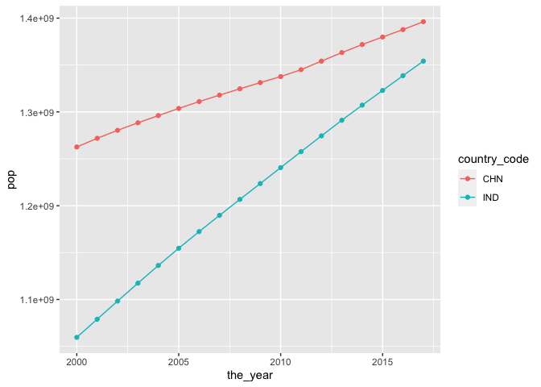
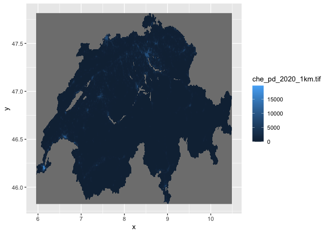
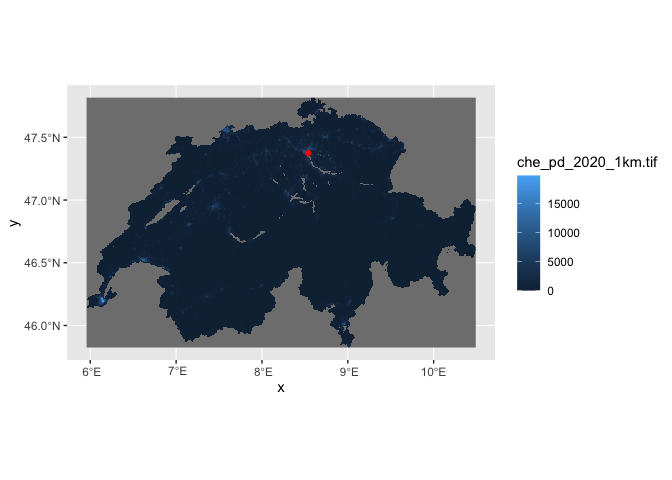
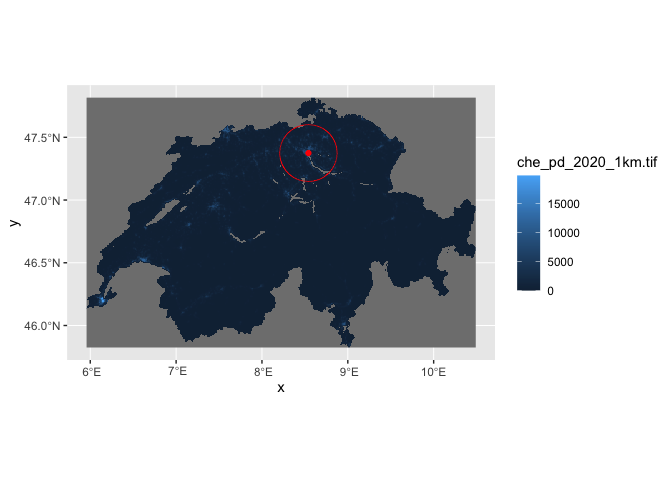
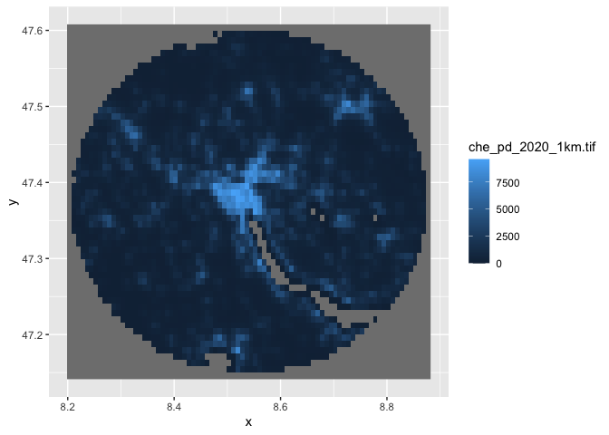
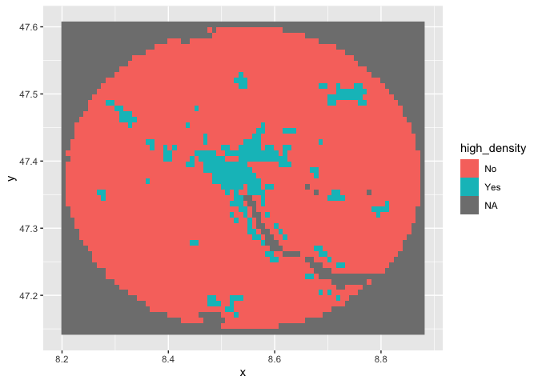
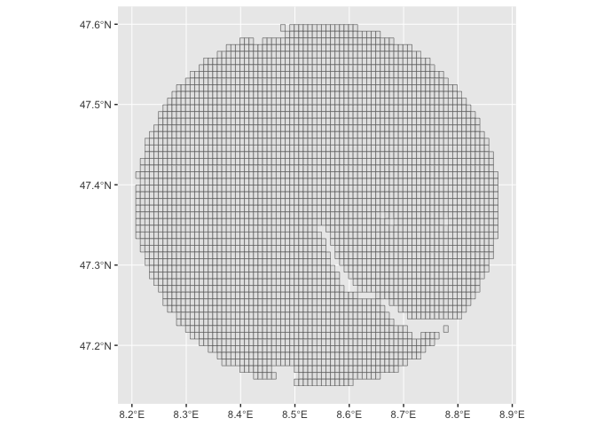
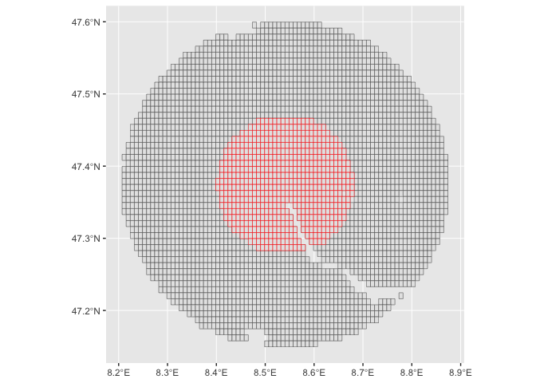

Ten Things I Love About R
================

# The tidyverse

When I first started using R, there was no
[tidyverse](https://www.tidyverse.org). There was just base R, which
caused me heartburn.

But the tidyverse changed all that. It makes using R a breeze.

The tidyverse has packages for [reading
data](https://readr.tidyverse.org), [manipulating
data](https://dplyr.tidyverse.org), [cleaning
data](https://tidyr.tidyverse.org) and many other things.

You can install them with just a simple command.

``` r
#install.packages(tidyverse)
```

Then you can load all the packages at once:

``` r
library(tidyverse)
```

    ── Attaching packages ─────────────────────────────────────── tidyverse 1.3.2 ──
    ✔ ggplot2 3.4.1     ✔ purrr   1.0.1
    ✔ tibble  3.1.8     ✔ dplyr   1.1.0
    ✔ tidyr   1.3.0     ✔ stringr 1.5.0
    ✔ readr   2.1.4     ✔ forcats 1.0.0
    ── Conflicts ────────────────────────────────────────── tidyverse_conflicts() ──
    ✖ dplyr::filter() masks stats::filter()
    ✖ dplyr::lag()    masks stats::lag()

The people behind the tidyverse believe in what they call tidy data.
It’s a concept we use every single day.

Each column is a variable. Each record is an observation. Every cell is
a single value.

Those concepts flow through other packages not in the tidyverse, but
adhere to tidy data principles.

For example, [sf](https://r-spatial.github.io/sf/) is a GIS package that
adheres to tidy principles, which you’ll see below. For rasters, there’s
[stars](https://r-spatial.github.io/stars/) package that’s meant for
spatio-temporal arrays.

For machine learning/modelling, there’s
[tidymodels](https://www.tidymodels.org).

One other thing. You’ll notice a number of R packages, particularly in
the tidyverse, have these

# Import Data

Importing data is a pain in the butt. I think R makes some of those
tasks easier.

You can deal with lots of

For example, if I need to get data into Postgres or SQL Server, I’ll use
R as an intermediary.

I can use the tidyverse’s [readr](https://readr.tidyverse.org).

``` r
single_dataset <- read_csv("./data/importing/abw.csv")
```

    Rows: 4 Columns: 19
    ── Column specification ────────────────────────────────────────────────────────
    Delimiter: ","
    chr  (1): indicator
    dbl (18): 2000, 2001, 2002, 2003, 2004, 2005, 2006, 2007, 2008, 2009, 2010, ...

    ℹ Use `spec()` to retrieve the full column specification for this data.
    ℹ Specify the column types or set `show_col_types = FALSE` to quiet this message.

``` r
single_dataset
```

    # A tibble: 4 × 19
      indic…¹ `2000`  `2001`  `2002`  `2003`  `2004`  `2005`  `2006`  `2007`  `2008`
      <chr>    <dbl>   <dbl>   <dbl>   <dbl>   <dbl>   <dbl>   <dbl>   <dbl>   <dbl>
    1 SP.URB… 4.16e4 4.20e+4 4.22e+4 4.23e+4 4.23e+4 4.24e+4 4.26e+4 4.27e+4 4.29e+4
    2 SP.URB… 1.66e0 9.56e-1 4.01e-1 1.97e-1 9.46e-2 1.94e-1 3.67e-1 4.08e-1 4.13e-1
    3 SP.POP… 8.91e4 9.07e+4 9.18e+4 9.27e+4 9.35e+4 9.45e+4 9.56e+4 9.68e+4 9.80e+4
    4 SP.POP… 2.54e0 1.77e+0 1.19e+0 9.97e-1 9.01e-1 1.00e+0 1.18e+0 1.23e+0 1.24e+0
    # … with 9 more variables: `2009` <dbl>, `2010` <dbl>, `2011` <dbl>,
    #   `2012` <dbl>, `2013` <dbl>, `2014` <dbl>, `2015` <dbl>, `2016` <dbl>,
    #   `2017` <dbl>, and abbreviated variable name ¹​indicator

You’ll see there are other [readr
functions](https://readr.tidyverse.org/reference/index.html) to help you
import data.

Sidenote: Have a SAS, SPSS or Stata dataset? You can import it with
[haven](https://haven.tidyverse.org).

One thing I like to do is import everything as character, then later
convert to appropriate data types. I can do that easily with
[read_csv](https://readr.tidyverse.org/reference/read_delim.html).

``` r
single_dataset <- read_csv("./data/importing/abw.csv", col_types = cols(.default = "c"))
```

# FS

OK. Say you have a directory of files. You want to import them all into
a single dataset.

There’s a tidy-friendly package called [fs](https://fs.r-lib.org) for
working with file systems.

You can install it like this:

``` r
#install.packages("fs")
```

Ok back to the topic at hand.

Let’s initialize fs.

``` r
library(fs)
```

What’s in our directory? Annoyingly, there’s a different file for every
country. What to do?

``` r
dir_ls(path="./data/importing")
```

    ./data/importing/ABW.csv ./data/importing/AFE.csv ./data/importing/AFG.csv 
    ./data/importing/AFW.csv ./data/importing/AGO.csv ./data/importing/ALB.csv 
    ./data/importing/AND.csv ./data/importing/ARB.csv ./data/importing/ARE.csv 
    ./data/importing/ARG.csv ./data/importing/ARM.csv ./data/importing/ASM.csv 
    ./data/importing/ATG.csv ./data/importing/AUS.csv ./data/importing/AUT.csv 
    ./data/importing/AZE.csv ./data/importing/BDI.csv ./data/importing/BEL.csv 
    ./data/importing/BEN.csv ./data/importing/BFA.csv ./data/importing/BGD.csv 
    ./data/importing/BGR.csv ./data/importing/BHR.csv ./data/importing/BHS.csv 
    ./data/importing/BIH.csv ./data/importing/BLR.csv ./data/importing/BLZ.csv 
    ./data/importing/BMU.csv ./data/importing/BOL.csv ./data/importing/BRA.csv 
    ./data/importing/BRB.csv ./data/importing/BRN.csv ./data/importing/BTN.csv 
    ./data/importing/BWA.csv ./data/importing/CAF.csv ./data/importing/CAN.csv 
    ./data/importing/CEB.csv ./data/importing/CHE.csv ./data/importing/CHI.csv 
    ./data/importing/CHL.csv ./data/importing/CHN.csv ./data/importing/CIV.csv 
    ./data/importing/CMR.csv ./data/importing/COD.csv ./data/importing/COG.csv 
    ./data/importing/COL.csv ./data/importing/COM.csv ./data/importing/CPV.csv 
    ./data/importing/CRI.csv ./data/importing/CSS.csv ./data/importing/CUB.csv 
    ./data/importing/CUW.csv ./data/importing/CYM.csv ./data/importing/CYP.csv 
    ./data/importing/CZE.csv ./data/importing/DEU.csv ./data/importing/DJI.csv 
    ./data/importing/DMA.csv ./data/importing/DNK.csv ./data/importing/DOM.csv 
    ./data/importing/DZA.csv ./data/importing/EAP.csv ./data/importing/EAR.csv 
    ./data/importing/EAS.csv ./data/importing/ECA.csv ./data/importing/ECS.csv 
    ./data/importing/ECU.csv ./data/importing/EGY.csv ./data/importing/EMU.csv 
    ./data/importing/ERI.csv ./data/importing/ESP.csv ./data/importing/EST.csv 
    ./data/importing/ETH.csv ./data/importing/EUU.csv ./data/importing/FCS.csv 
    ./data/importing/FIN.csv ./data/importing/FJI.csv ./data/importing/FRA.csv 
    ./data/importing/FRO.csv ./data/importing/FSM.csv ./data/importing/GAB.csv 
    ./data/importing/GBR.csv ./data/importing/GEO.csv ./data/importing/GHA.csv 
    ./data/importing/GIB.csv ./data/importing/GIN.csv ./data/importing/GMB.csv 
    ./data/importing/GNB.csv ./data/importing/GNQ.csv ./data/importing/GRC.csv 
    ./data/importing/GRD.csv ./data/importing/GRL.csv ./data/importing/GTM.csv 
    ./data/importing/GUM.csv ./data/importing/GUY.csv ./data/importing/HIC.csv 
    ./data/importing/HKG.csv ./data/importing/HND.csv ./data/importing/HPC.csv 
    ./data/importing/HRV.csv ./data/importing/HTI.csv ./data/importing/HUN.csv 
    ./data/importing/IBD.csv ./data/importing/IBT.csv ./data/importing/IDA.csv 
    ./data/importing/IDB.csv ./data/importing/IDN.csv ./data/importing/IDX.csv 
    ./data/importing/IMN.csv ./data/importing/IND.csv ./data/importing/INX.csv 
    ./data/importing/IRL.csv ./data/importing/IRN.csv ./data/importing/IRQ.csv 
    ./data/importing/ISL.csv ./data/importing/ISR.csv ./data/importing/ITA.csv 
    ./data/importing/JAM.csv ./data/importing/JOR.csv ./data/importing/JPN.csv 
    ./data/importing/KAZ.csv ./data/importing/KEN.csv ./data/importing/KGZ.csv 
    ./data/importing/KHM.csv ./data/importing/KIR.csv ./data/importing/KNA.csv 
    ./data/importing/KOR.csv ./data/importing/KWT.csv ./data/importing/LAC.csv 
    ./data/importing/LAO.csv ./data/importing/LBN.csv ./data/importing/LBR.csv 
    ./data/importing/LBY.csv ./data/importing/LCA.csv ./data/importing/LCN.csv 
    ./data/importing/LDC.csv ./data/importing/LIC.csv ./data/importing/LIE.csv 
    ./data/importing/LKA.csv ./data/importing/LMC.csv ./data/importing/LMY.csv 
    ./data/importing/LSO.csv ./data/importing/LTE.csv ./data/importing/LTU.csv 
    ./data/importing/LUX.csv ./data/importing/LVA.csv ./data/importing/MAC.csv 
    ./data/importing/MAF.csv ./data/importing/MAR.csv ./data/importing/MCO.csv 
    ./data/importing/MDA.csv ./data/importing/MDG.csv ./data/importing/MDV.csv 
    ./data/importing/MEA.csv ./data/importing/MEX.csv ./data/importing/MHL.csv 
    ./data/importing/MIC.csv ./data/importing/MKD.csv ./data/importing/MLI.csv 
    ./data/importing/MLT.csv ./data/importing/MMR.csv ./data/importing/MNA.csv 
    ./data/importing/MNE.csv ./data/importing/MNG.csv ./data/importing/MNP.csv 
    ./data/importing/MOZ.csv ./data/importing/MRT.csv ./data/importing/MUS.csv 
    ./data/importing/MWI.csv ./data/importing/MYS.csv ./data/importing/NAC.csv 
    ./data/importing/NAM.csv ./data/importing/NCL.csv ./data/importing/NER.csv 
    ./data/importing/NGA.csv ./data/importing/NIC.csv ./data/importing/NLD.csv 
    ./data/importing/NOR.csv ./data/importing/NPL.csv ./data/importing/NRU.csv 
    ./data/importing/NZL.csv ./data/importing/OED.csv ./data/importing/OMN.csv 
    ./data/importing/OSS.csv ./data/importing/PAK.csv ./data/importing/PAN.csv 
    ./data/importing/PER.csv ./data/importing/PHL.csv ./data/importing/PLW.csv 
    ./data/importing/PNG.csv ./data/importing/POL.csv ./data/importing/PRE.csv 
    ./data/importing/PRI.csv ./data/importing/PRK.csv ./data/importing/PRT.csv 
    ./data/importing/PRY.csv ./data/importing/PSE.csv ./data/importing/PSS.csv 
    ./data/importing/PST.csv ./data/importing/PYF.csv ./data/importing/QAT.csv 
    ./data/importing/ROU.csv ./data/importing/RUS.csv ./data/importing/RWA.csv 
    ./data/importing/SAS.csv ./data/importing/SAU.csv ./data/importing/SDN.csv 
    ./data/importing/SEN.csv ./data/importing/SGP.csv ./data/importing/SLB.csv 
    ./data/importing/SLE.csv ./data/importing/SLV.csv ./data/importing/SMR.csv 
    ./data/importing/SOM.csv ./data/importing/SRB.csv ./data/importing/SSA.csv 
    ./data/importing/SSD.csv ./data/importing/SSF.csv ./data/importing/SST.csv 
    ./data/importing/STP.csv ./data/importing/SUR.csv ./data/importing/SVK.csv 
    ./data/importing/SVN.csv ./data/importing/SWE.csv ./data/importing/SWZ.csv 
    ./data/importing/SXM.csv ./data/importing/SYC.csv ./data/importing/SYR.csv 
    ./data/importing/TCA.csv ./data/importing/TCD.csv ./data/importing/TEA.csv 
    ./data/importing/TEC.csv ./data/importing/TGO.csv ./data/importing/THA.csv 
    ./data/importing/TJK.csv ./data/importing/TKM.csv ./data/importing/TLA.csv 
    ./data/importing/TLS.csv ./data/importing/TMN.csv ./data/importing/TON.csv 
    ./data/importing/TSA.csv ./data/importing/TSS.csv ./data/importing/TTO.csv 
    ./data/importing/TUN.csv ./data/importing/TUR.csv ./data/importing/TUV.csv 
    ./data/importing/TZA.csv ./data/importing/UGA.csv ./data/importing/UKR.csv 
    ./data/importing/UMC.csv ./data/importing/URY.csv ./data/importing/USA.csv 
    ./data/importing/UZB.csv ./data/importing/VCT.csv ./data/importing/VEN.csv 
    ./data/importing/VGB.csv ./data/importing/VIR.csv ./data/importing/VNM.csv 
    ./data/importing/VUT.csv ./data/importing/WLD.csv ./data/importing/WSM.csv 
    ./data/importing/XKX.csv ./data/importing/YEM.csv ./data/importing/ZAF.csv 
    ./data/importing/ZMB.csv ./data/importing/ZWE.csv 

fs makes it easy.

``` r
imported_data_collection <- dir_ls(path="./data/importing") %>%
  map_df(read_csv, .id = "file", col_types = cols(.default = "c")) # map applies a function to each record...so if each filename from dir_ls is a record, this applies read_csv to each record. 

imported_data_collection
```

    # A tibble: 1,064 × 20
       file   indic…¹ `2000` `2001` `2002` `2003` `2004` `2005` `2006` `2007` `2008`
       <chr>  <chr>   <chr>  <chr>  <chr>  <chr>  <chr>  <chr>  <chr>  <chr>  <chr> 
     1 ./dat… SP.URB… 41625  42025  42194  42277  42317  42399  42555  42729  42906 
     2 ./dat… SP.URB… 1.664… 0.956… 0.401… 0.196… 0.094… 0.193… 0.367… 0.408… 0.413…
     3 ./dat… SP.POP… 89101  90691  91781  92701  93540  94483  95606  96787  97996 
     4 ./dat… SP.POP… 2.539… 1.768… 1.194… 0.997… 0.900… 1.003… 1.181… 1.227… 1.241…
     5 ./dat… SP.URB… 11555… 11977… 12422… 12883… 13364… 13874… 14402… 14923… 15538…
     6 ./dat… SP.URB… 3.602… 3.655… 3.716… 3.708… 3.736… 3.814… 3.806… 3.613… 4.122…
     7 ./dat… SP.POP… 40160… 41200… 42274… 43380… 44528… 45715… 46950… 48240… 49574…
     8 ./dat… SP.POP… 2.583… 2.589… 2.606… 2.617… 2.644… 2.666… 2.702… 2.747… 2.765…
     9 ./dat… SP.URB… 43147… 43647… 46748… 50618… 52995… 55420… 58282… 59870… 61628…
    10 ./dat… SP.URB… 1.861… 1.153… 6.863… 7.953… 4.588… 4.474… 5.034… 2.688… 2.893…
    # … with 1,054 more rows, 9 more variables: `2009` <chr>, `2010` <chr>,
    #   `2011` <chr>, `2012` <chr>, `2013` <chr>, `2014` <chr>, `2015` <chr>,
    #   `2016` <chr>, `2017` <chr>, and abbreviated variable name ¹​indicator

And, take note how it also includes the filename from which that data
originated. Useful.

# Clean column names

I use a single function from the [janitor
package](https://sfirke.github.io/janitor/index.html). More precisely: I
use
[clean_names](https://sfirke.github.io/janitor/reference/clean_names.html)
constantly.

The data we just imported gives us a perfect use case. Here are our ugly
column names. Column names starting with numbers? Unacceptable.

``` r
colnames(imported_data_collection)
```

     [1] "file"      "indicator" "2000"      "2001"      "2002"      "2003"     
     [7] "2004"      "2005"      "2006"      "2007"      "2008"      "2009"     
    [13] "2010"      "2011"      "2012"      "2013"      "2014"      "2015"     
    [19] "2016"      "2017"     

Yuck. But we can use clean_names:

``` r
imported_data_collection_fixed <- imported_data_collection %>%
  janitor::clean_names() # Notice here that I used the library name and function name. You can do this if you don't want to load the entire package into memory. 

imported_data_collection_fixed
```

    # A tibble: 1,064 × 20
       file      indic…¹ x2000 x2001 x2002 x2003 x2004 x2005 x2006 x2007 x2008 x2009
       <chr>     <chr>   <chr> <chr> <chr> <chr> <chr> <chr> <chr> <chr> <chr> <chr>
     1 ./data/i… SP.URB… 41625 42025 42194 42277 42317 42399 42555 42729 42906 43079
     2 ./data/i… SP.URB… 1.66… 0.95… 0.40… 0.19… 0.09… 0.19… 0.36… 0.40… 0.41… 0.40…
     3 ./data/i… SP.POP… 89101 90691 91781 92701 93540 94483 95606 96787 97996 99212
     4 ./data/i… SP.POP… 2.53… 1.76… 1.19… 0.99… 0.90… 1.00… 1.18… 1.22… 1.24… 1.23…
     5 ./data/i… SP.URB… 1155… 1197… 1242… 1288… 1336… 1387… 1440… 1492… 1553… 1617…
     6 ./data/i… SP.URB… 3.60… 3.65… 3.71… 3.70… 3.73… 3.81… 3.80… 3.61… 4.12… 4.11…
     7 ./data/i… SP.POP… 4016… 4120… 4227… 4338… 4452… 4571… 4695… 4824… 4957… 5094…
     8 ./data/i… SP.POP… 2.58… 2.58… 2.60… 2.61… 2.64… 2.66… 2.70… 2.74… 2.76… 2.75…
     9 ./data/i… SP.URB… 4314… 4364… 4674… 5061… 5299… 5542… 5828… 5987… 6162… 6443…
    10 ./data/i… SP.URB… 1.86… 1.15… 6.86… 7.95… 4.58… 4.47… 5.03… 2.68… 2.89… 4.44…
    # … with 1,054 more rows, 8 more variables: x2010 <chr>, x2011 <chr>,
    #   x2012 <chr>, x2013 <chr>, x2014 <chr>, x2015 <chr>, x2016 <chr>,
    #   x2017 <chr>, and abbreviated variable name ¹​indicator

# Work with dates

``` r
library(nycflights13)
library(lubridate)
```


    Attaching package: 'lubridate'

    The following objects are masked from 'package:base':

        date, intersect, setdiff, union

We can use lubridate to do some nice things.

``` r
flights %>% 
  select(year, month, day, hour, minute) %>% 
  mutate(departure = make_datetime(year, month, day, hour, minute))
```

    # A tibble: 336,776 × 6
        year month   day  hour minute departure          
       <int> <int> <int> <dbl>  <dbl> <dttm>             
     1  2013     1     1     5     15 2013-01-01 05:15:00
     2  2013     1     1     5     29 2013-01-01 05:29:00
     3  2013     1     1     5     40 2013-01-01 05:40:00
     4  2013     1     1     5     45 2013-01-01 05:45:00
     5  2013     1     1     6      0 2013-01-01 06:00:00
     6  2013     1     1     5     58 2013-01-01 05:58:00
     7  2013     1     1     6      0 2013-01-01 06:00:00
     8  2013     1     1     6      0 2013-01-01 06:00:00
     9  2013     1     1     6      0 2013-01-01 06:00:00
    10  2013     1     1     6      0 2013-01-01 06:00:00
    # … with 336,766 more rows

We can easily extract elements of the date.

``` r
flights %>% 
  select(year, month, day, hour, minute) %>% 
  mutate(departure = make_datetime(year, month, day, hour, minute)) %>%
  select(departure) %>%
  mutate(the_year = year(departure),
         the_day = day(departure))
```

    # A tibble: 336,776 × 3
       departure           the_year the_day
       <dttm>                 <dbl>   <int>
     1 2013-01-01 05:15:00     2013       1
     2 2013-01-01 05:29:00     2013       1
     3 2013-01-01 05:40:00     2013       1
     4 2013-01-01 05:45:00     2013       1
     5 2013-01-01 06:00:00     2013       1
     6 2013-01-01 05:58:00     2013       1
     7 2013-01-01 06:00:00     2013       1
     8 2013-01-01 06:00:00     2013       1
     9 2013-01-01 06:00:00     2013       1
    10 2013-01-01 06:00:00     2013       1
    # … with 336,766 more rows

And then we can do all kinds of things with differences in times.

``` r
make_datetime_100 <- function(year, month, day, time) {
  make_datetime(year, month, day, time %/% 100, time %% 100)
}

flights_dt <- flights %>% 
  filter(!is.na(dep_time), !is.na(arr_time)) %>% 
  mutate(
    dep_time = make_datetime_100(year, month, day, dep_time),
    arr_time = make_datetime_100(year, month, day, arr_time),
    sched_dep_time = make_datetime_100(year, month, day, sched_dep_time),
    sched_arr_time = make_datetime_100(year, month, day, sched_arr_time)
  ) %>% 
  select(origin, dest, ends_with("delay"), ends_with("time"))

flights_dt
```

    # A tibble: 328,063 × 9
       origin dest  dep_delay arr_delay dep_time            sched_dep_time     
       <chr>  <chr>     <dbl>     <dbl> <dttm>              <dttm>             
     1 EWR    IAH           2        11 2013-01-01 05:17:00 2013-01-01 05:15:00
     2 LGA    IAH           4        20 2013-01-01 05:33:00 2013-01-01 05:29:00
     3 JFK    MIA           2        33 2013-01-01 05:42:00 2013-01-01 05:40:00
     4 JFK    BQN          -1       -18 2013-01-01 05:44:00 2013-01-01 05:45:00
     5 LGA    ATL          -6       -25 2013-01-01 05:54:00 2013-01-01 06:00:00
     6 EWR    ORD          -4        12 2013-01-01 05:54:00 2013-01-01 05:58:00
     7 EWR    FLL          -5        19 2013-01-01 05:55:00 2013-01-01 06:00:00
     8 LGA    IAD          -3       -14 2013-01-01 05:57:00 2013-01-01 06:00:00
     9 JFK    MCO          -3        -8 2013-01-01 05:57:00 2013-01-01 06:00:00
    10 LGA    ORD          -2         8 2013-01-01 05:58:00 2013-01-01 06:00:00
    # … with 328,053 more rows, and 3 more variables: arr_time <dttm>,
    #   sched_arr_time <dttm>, air_time <dbl>

You can do simple date comparisons.

``` r
flights_dt %>% 
  mutate(late_departure = difftime(ymd_hms(sched_dep_time), ymd_hms(dep_time), units="secs"))
```

    # A tibble: 328,063 × 10
       origin dest  dep_delay arr_delay dep_time            sched_dep_time     
       <chr>  <chr>     <dbl>     <dbl> <dttm>              <dttm>             
     1 EWR    IAH           2        11 2013-01-01 05:17:00 2013-01-01 05:15:00
     2 LGA    IAH           4        20 2013-01-01 05:33:00 2013-01-01 05:29:00
     3 JFK    MIA           2        33 2013-01-01 05:42:00 2013-01-01 05:40:00
     4 JFK    BQN          -1       -18 2013-01-01 05:44:00 2013-01-01 05:45:00
     5 LGA    ATL          -6       -25 2013-01-01 05:54:00 2013-01-01 06:00:00
     6 EWR    ORD          -4        12 2013-01-01 05:54:00 2013-01-01 05:58:00
     7 EWR    FLL          -5        19 2013-01-01 05:55:00 2013-01-01 06:00:00
     8 LGA    IAD          -3       -14 2013-01-01 05:57:00 2013-01-01 06:00:00
     9 JFK    MCO          -3        -8 2013-01-01 05:57:00 2013-01-01 06:00:00
    10 LGA    ORD          -2         8 2013-01-01 05:58:00 2013-01-01 06:00:00
    # … with 328,053 more rows, and 4 more variables: arr_time <dttm>,
    #   sched_arr_time <dttm>, air_time <dbl>, late_departure <drtn>

# Interact with databases

OK. I’ve imported my data and I want to send it to Postgres.

[RPostgres](https://rpostgres.r-dbi.org) makes that easy.

First, if needed, install via:

``` r
#install.packages("RPostgres")
```

To connect with the DB, you first need to set up a little connection
string to the DB. If you’ve ever used ODBC, it’s kinda similar to that
process.

Here’s one for a local Postgres install. Notice I used the
askForPassword function. That’s so I don’t encode my username and
password when I plan to upload this to Github.

``` r
library(RPostgres)

con <- dbConnect(RPostgres::Postgres(),
                 dbname = 'test2', 
                 host = "localhost", 
                 port = 5432, # or any other port specified by your DBA
                 user = "rstudio", 
                 password = "baseball1"
)
```

From here, you can do [all kinds of
things](https://rpostgres.r-dbi.org/reference/index.html).

Want to send our dataset to the DB?

``` r
dbWriteTable(con, "my_table_name", imported_data_collection_fixed, overwrite=TRUE)
```

Want to read it back?

``` r
showing_off <- dbReadTable(con, "my_table_name")

showing_off %>%
  slice(1:100) # this tells me to just provide records 1 through 100
```

                            file   indicator              x2000               x2001
    1   ./data/importing/ABW.csv SP.URB.TOTL              41625               42025
    2   ./data/importing/ABW.csv SP.URB.GROW   1.66422212392663   0.956373099407145
    3   ./data/importing/ABW.csv SP.POP.TOTL              89101               90691
    4   ./data/importing/ABW.csv SP.POP.GROW   2.53923444445246    1.76875662143885
    5   ./data/importing/AFE.csv SP.URB.TOTL          115551653           119775502
    6   ./data/importing/AFE.csv SP.URB.GROW   3.60226233978761    3.65537739213475
    7   ./data/importing/AFE.csv SP.POP.TOTL          401600588           412001885
    8   ./data/importing/AFE.csv SP.POP.GROW    2.5835792421522    2.58996060035651
    9   ./data/importing/AFG.csv SP.URB.TOTL            4314700             4364773
    10  ./data/importing/AFG.csv SP.URB.GROW   1.86137729962901    1.15383861520503
    11  ./data/importing/AFG.csv SP.POP.TOTL           19542982            19688632
    12  ./data/importing/AFG.csv SP.POP.GROW    1.4438030241194   0.742516834396313
    13  ./data/importing/AFW.csv SP.URB.TOTL           95272890            99624942
    14  ./data/importing/AFW.csv SP.URB.GROW   4.14518949083499    4.56798570926105
    15  ./data/importing/AFW.csv SP.POP.TOTL          269611898           277160097
    16  ./data/importing/AFW.csv SP.POP.GROW   2.74959971917366    2.79965352270915
    17  ./data/importing/AGO.csv SP.URB.TOTL            8211294             8686629
    18  ./data/importing/AGO.csv SP.URB.GROW   5.64866955326432    5.62744231595919
    19  ./data/importing/AGO.csv SP.POP.TOTL           16394062            16941587
    20  ./data/importing/AGO.csv SP.POP.GROW   3.24412146672851    3.28521723299089
    21  ./data/importing/ALB.csv SP.URB.TOTL            1289391             1298584
    22  ./data/importing/ALB.csv SP.URB.GROW  0.742478629285177   0.710442617598151
    23  ./data/importing/ALB.csv SP.POP.TOTL            3089027             3060173
    24  ./data/importing/ALB.csv SP.POP.GROW -0.637356833943492   -0.93847042771206
    25  ./data/importing/AND.csv SP.URB.TOTL              61070               62432
    26  ./data/importing/AND.csv SP.URB.GROW  0.377327984395132    2.20572172056573
    27  ./data/importing/AND.csv SP.POP.TOTL              66097               67820
    28  ./data/importing/AND.csv SP.POP.GROW  0.670960073758389    2.57337766489402
    29  ./data/importing/ARB.csv SP.URB.TOTL          152305719           156476716
    30  ./data/importing/ARB.csv SP.URB.GROW   2.76137514575139    2.73856886490258
    31  ./data/importing/ARB.csv SP.POP.TOTL          287065982           293512340
    32  ./data/importing/ARB.csv SP.POP.GROW   2.28593431739384    2.24560150077274
    33  ./data/importing/ARE.csv SP.URB.TOTL            2627996             2785983
    34  ./data/importing/ARE.csv SP.URB.GROW   6.11272936104507    5.83791948495437
    35  ./data/importing/ARE.csv SP.POP.TOTL            3275333             3454198
    36  ./data/importing/ARE.csv SP.POP.GROW   5.58038700101525    5.31707596147158
    37  ./data/importing/ARG.csv SP.URB.TOTL           33045629            33480950
    38  ./data/importing/ARG.csv SP.URB.GROW   1.34664689815167    1.30873169770709
    39  ./data/importing/ARG.csv SP.POP.TOTL           37070774            37480493
    40  ./data/importing/ARG.csv SP.POP.GROW   1.13327702210541     1.0991714603689
    41  ./data/importing/ARM.csv SP.URB.TOTL            2048957             2017268
    42  ./data/importing/ARM.csv SP.URB.GROW  -1.61037490478258   -1.55867624443429
    43  ./data/importing/ARM.csv SP.POP.TOTL            3168523             3133133
    44  ./data/importing/ARM.csv SP.POP.GROW  -1.17678628879226   -1.12320863167984
    45  ./data/importing/ASM.csv SP.URB.TOTL              51584               51611
    46  ./data/importing/ASM.csv SP.URB.GROW    1.6142305917451  0.0523281178663842
    47  ./data/importing/ASM.csv SP.POP.TOTL              58230               58324
    48  ./data/importing/ASM.csv SP.POP.GROW   1.09822902395737    0.16129866050102
    49  ./data/importing/ATG.csv SP.URB.TOTL              24113               24191
    50  ./data/importing/ATG.csv SP.URB.GROW   0.53641727893261   0.322954901436329
    51  ./data/importing/ATG.csv SP.POP.TOTL              75055               76215
    52  ./data/importing/ATG.csv SP.POP.GROW   1.65779341376666    1.53371156016655
    53  ./data/importing/AUS.csv SP.URB.TOTL           16028911            16210024
    54  ./data/importing/AUS.csv SP.URB.GROW  0.984333804176905    1.12357871219199
    55  ./data/importing/AUS.csv SP.POP.TOTL           19028802            19274701
    56  ./data/importing/AUS.csv SP.POP.GROW   1.14447285147721    1.28396809127349
    57  ./data/importing/AUT.csv SP.URB.TOTL            4824004             4820068
    58  ./data/importing/AUT.csv SP.URB.GROW -0.220175991539749 -0.0816252765125744
    59  ./data/importing/AUT.csv SP.POP.TOTL            8011566             8042293
    60  ./data/importing/AUT.csv SP.POP.GROW  0.240466652446524   0.382799394483217
    61  ./data/importing/AZE.csv SP.URB.TOTL            4135854             4184325
    62  ./data/importing/AZE.csv SP.URB.GROW   1.21344378120309    1.16515638336764
    63  ./data/importing/AZE.csv SP.POP.TOTL            8048600             8111200
    64  ./data/importing/AZE.csv SP.POP.GROW  0.821519963674211   0.774765939386613
    65  ./data/importing/BDI.csv SP.URB.TOTL             520130              547065
    66  ./data/importing/BDI.csv SP.URB.GROW   4.62153763088361    5.04888450132963
    67  ./data/importing/BDI.csv SP.POP.TOTL            6307659             6465729
    68  ./data/importing/BDI.csv SP.POP.GROW    2.0417212041938    2.47511575866868
    69  ./data/importing/BEL.csv SP.URB.TOTL            9956937             9997106
    70  ./data/importing/BEL.csv SP.URB.GROW  0.308431312307231   0.402615693084428
    71  ./data/importing/BEL.csv SP.POP.TOTL           10251250            10286570
    72  ./data/importing/BEL.csv SP.POP.GROW  0.242517956221334   0.343951157623668
    73  ./data/importing/BEN.csv SP.URB.TOTL            2682552             2787454
    74  ./data/importing/BEN.csv SP.URB.GROW   3.87148751501267     3.8360054170946
    75  ./data/importing/BEN.csv SP.POP.TOTL            6998023             7212041
    76  ./data/importing/BEN.csv SP.POP.GROW   3.03845662138601     3.0124309700982
    77  ./data/importing/BFA.csv SP.URB.TOTL            2120383             2271106
    78  ./data/importing/BFA.csv SP.URB.GROW   6.85756484832227    6.86702047633563
    79  ./data/importing/BFA.csv SP.POP.TOTL           11882888            12249764
    80  ./data/importing/BFA.csv SP.POP.GROW   2.98388558736392    3.04072894648829
    81  ./data/importing/BGD.csv SP.URB.TOTL           30476706            31727320
    82  ./data/importing/BGD.csv SP.URB.GROW   3.56396663214103    4.02154852620664
    83  ./data/importing/BGD.csv SP.POP.TOTL          129193327           131670484
    84  ./data/importing/BGD.csv SP.POP.GROW   1.90552404891968    1.89925268099487
    85  ./data/importing/BGR.csv SP.URB.TOTL            5629167             5539603
    86  ./data/importing/BGR.csv SP.URB.GROW -0.171157650642926   -1.60386362919759
    87  ./data/importing/BGR.csv SP.POP.TOTL            8170172             8009142
    88  ./data/importing/BGR.csv SP.POP.GROW -0.493896416633318   -1.99063220438276
    89  ./data/importing/BHR.csv SP.URB.TOTL             628716              645321
    90  ./data/importing/BHR.csv SP.URB.GROW   2.74720093000752    2.60682230104421
    91  ./data/importing/BHR.csv SP.POP.TOTL             711442              730257
    92  ./data/importing/BHR.csv SP.POP.GROW    2.7515762605179     2.6102630692956
    93  ./data/importing/BHS.csv SP.URB.TOTL             266534              270455
    94  ./data/importing/BHS.csv SP.URB.GROW   1.69321459564921    1.46039106465837
    95  ./data/importing/BHS.csv SP.POP.TOTL             325014              329626
    96  ./data/importing/BHS.csv SP.POP.GROW   1.46976235766802    1.40904200942925
    97  ./data/importing/BIH.csv SP.URB.TOTL            1771376             1791152
    98  ./data/importing/BIH.csv SP.URB.GROW   1.37816316655527    1.11023425698696
    99  ./data/importing/BIH.csv SP.POP.TOTL            4179350             4194932
    100 ./data/importing/BIH.csv SP.POP.GROW  0.632139635256837   0.372139796167984
                     x2002              x2003              x2004              x2005
    1                42194              42277              42317              42399
    2    0.401335154395215  0.196517211141057 0.0945693618486456  0.193588048559493
    3                91781              92701              93540              94483
    4     1.19471805545637  0.997395547284924  0.900989229759957   1.00307718391638
    5            124227507          128833965          133647466          138745587
    6      3.7169579134805   3.70808213997242   3.73620496737797   3.81460356307841
    7            422741118          433807484          445281555          457153837
    8     2.60659802563768     2.617764283814   2.64496843028186   2.66624158730311
    9              4674867            5061866            5299549            5542073
    10    6.86345297807244   7.95344768841497   4.58865325754718   4.47468958963317
    11            21000256           22645130           23553551           24411191
    12    6.44932147797304   7.54101896480183   3.93317768847308   3.57650800354462
    13           104163982          108909607          113875177          119079574
    14    4.55612812301563   4.55591741874845   4.55934984688724   4.57026468551614
    15           284952322          292977949          301265247          309824829
    16     2.8114526890211   2.81648064619036   2.82864223341259   2.84121122009138
    17             9189142            9722803           10291645           10892537
    18    5.62376227868434   5.64513817273351   5.68584496286432   5.67454748217163
    19            17516139           18124342           18771125           19450959
    20    3.33513160843876   3.41332121240757   3.50638882370405   3.55765898910381
    21             1327220            1354848            1381828            1407298
    22    2.18120890441126   2.06027418181457   1.97179893742068   1.82642935665107
    23             3051010            3039616            3026939            3011487
    24  -0.299876697084691 -0.374149169291299 -0.417931377925999 -0.511790116421897
    25               64927              67408              69817              72071
    26    3.91855974083943   3.75001433875657   3.51138278860428   3.17742111163013
    27               70849              73907              76933              79826
    28    4.36937150135481    4.2256694355319   4.01273671344563   3.69143527252581
    29           160709287          165028788          169454014          174496874
    30    2.70492064774672   2.68777310921678   2.68148730511189   2.97594602863759
    31           300018650          306573087          313249616          320558754
    32    2.21670748153213   2.18467651927638   2.17779357781657   2.33332704229076
    33             2945695            3106888            3269387            3521630
    34    5.57440090696271   5.32767996564432   5.09809234355025   7.43214450465337
    35             3633655            3813443            3993339            4280993
    36    5.06487258360989   4.82934268529322     4.609526743863   6.95572689795874
    37            33910889           34330154           34747780           35175563
    38    1.27595518811745   1.22879210827292   1.20915917460343   1.22359234802314
    39            37885028           38278164           38668796           39070501
    40    1.07353834961783   1.03236085902218   1.01533668354561   1.03347622351885
    41             1994552            1978050            1963242            1948348
    42   -1.13246570248286  -0.83079527809499 -0.751432255097974 -0.761535435957295
    43             3105037            3084102            3065745            3047246
    44  -0.900783081509756 -0.676510249442033 -0.596992234773189 -0.605237484238947
    45               51425              51160              50825              50441
    46  -0.361039252380598 -0.516645882837897 -0.656961719623165  -0.75840230789254
    47               58177              57941              57626              57254
    48  -0.252358482783624 -0.406483620024703 -0.545139668053888 -0.647634575615904
    49               24006              23785              23554              23336
    50  -0.767686406077838 -0.924866921890812 -0.975947246488804 -0.929842485393645
    51               77195              78075              78941              79869
    52    1.27763943800851   1.13352150752522   1.10308348343215   1.16870545018922
    53            16419256           16633061           16835775           17065978
    54    1.28249760868533   1.29375488089444   1.21137453896552   1.35808044012136
    55            19495210           19720737           19932722           20176844
    56     1.1375387361946   1.15019273319182   1.06919812205752   1.21729073052406
    57             4821291            4822095            4829142            4839033
    58  0.0253698675997875 0.0166746410827647  0.146033119948255  0.204609524563365
    59             8081957            8121423            8171966            8227829
    60    0.49198046425522  0.487133894826838  0.620413127334181  0.681267248299787
    61             4232008            4280744            4335079            4396406
    62    1.13311843032047   1.14502413490342   1.26130075641327   1.40475551381099
    63             8171950            8234100            8306500            8391850
    64   0.746173582716985  0.757650955616913  0.875427280482454   1.02226559239828
    65              577261             611164             650742             692707
    66    5.37268785774085   5.70708316726612   6.27479146975711    6.2493860070609
    67             6648938            6860846            7120496            7388874
    68    2.79413757787033   3.13736150828626   3.71466281696618   3.69979693670807
    69            10047703           10095562           10144977           10206487
    70   0.504840005818933  0.475187017156648   0.48827848090044  0.604479238401223
    71            10332785           10376133           10421137           10478617
    72   0.448268894821562  0.418641508069053  0.432788248129175  0.550055708089009
    73             2901071            3028144            3160900            3304019
    74    3.99513447510548   4.28699114281374    4.2906906587585   4.42828090728256
    75             7431783            7659208            7894554            8149419
    76    3.00138127284262   3.01427811282378   3.02645705105477     3.177348170646
    77             2432722            2605597            2790981            2988501
    78    6.87438575377423   6.86510285676784   6.87313233222337   6.83787769629743
    79            12632269           13030591           13445977           13876127
    80    3.07479003510637   3.10451751268277   3.13802065225682   3.14899280596388
    81            33207655           34711400           36243549           37777256
    82    4.56022822596011    4.4287741624036   4.31932435855494   4.14458215704186
    83           134139826          136503206          138789725          140912590
    84    1.85802653007171   1.74653680101613   1.66119164263389   1.51797511096499
    85             5448708            5433321            5419782            5406009
    86   -1.65443211908207 -0.282796714742491 -0.249495596294176 -0.254448057069833
    87             7837161            7775327            7716860            7658972
    88   -2.17069878030004  -0.79211363763553 -0.754796951273604 -0.752977445493645
    89              661316             687846             736762             797497
    90    2.44839217402731   3.93331865129447   6.86999335666605   7.92131636610236
    91              748324             778256             833451             901921
    92    2.44395122899014   3.92194796267708   6.85193933235192   7.89520208580362
    93              274189             278015             281937             285957
    94    1.37119237681649   1.38574194491706   1.40085726547946   1.41578081415146
    95              334002             338490             343089             347804
    96    1.31883025634015     1.334756883574   1.34953389082619   1.36492139898865
    97             1805904            1812822            1808276            1800058
    98   0.820230916996715  0.382344970451888 -0.251084195362237 -0.455501858145626
    99             4198410            4183757            4142860            4094297
    100 0.0828752170247773 -0.349623550237269 -0.982327609602979  -1.17913407901923
                     x2006              x2007              x2008              x2009
    1                42555              42729              42906              43079
    2    0.367257987480091  0.408048969163451  0.413382967375507  0.402396309678717
    3                95606              96787              97996              99212
    4     1.18156554573069   1.22771081489399   1.24139737678817   1.23323132057229
    5            144026740          149231302          155383774          161776165
    6     3.80635745913851   3.61360813971072    4.1227757967293   4.11393727635938
    7            469508516          482406426          495748900          509410477
    8     2.70252112091536   2.74710885116298   2.76581597609149   2.75574529766985
    9              5828215            5987030            6162823            6443215
    10    5.03421600301046   2.68846842633562   2.89394890008399   4.44926873597444
    11            25442944           25903301           26427199           27385307
    12    4.13967803534352   1.79319572747206   2.00233326232255   3.56128837446668
    13           124507242          130133054          135972155          142060079
    14    4.55801764960965   4.51846166506525   4.48702371958471   4.47733140656629
    15           318601484          327612838          336893835          346475221
    16    2.83277974471181    2.8284092989347   2.83291615086219   2.84403720240236
    17            11444951           12028087           12642253           13287180
    18    4.94707962134254   4.96958261730382   4.98001182832443   4.97550440874176
    19            20162340           20909684           21691522           22507674
    20     3.5920133134417   3.63958930439587   3.67090920225351   3.69348247645612
    21             1430886            1452398            1473392            1495260
    22    1.66222789724062   1.49221506952818   1.43512421072918   1.47328791317413
    23             2992547            2970017            2947314            2927519
    24  -0.630911244851673  -0.75571875541991 -0.767342959142321 -0.673894046451936
    25               72044              69810              67692              65663
    26  -0.037470076419389   -3.1499777492501  -3.08092614364707   -3.0432403598387
    27               80221              78168              76055              73852
    28   0.493606005740852  -2.59249693414403  -2.74035938783357  -2.93936722302096
    29           180242023          186027900          192585424          199211212
    30    3.29240797746326   3.21005995366575   3.52502178436676   3.44044105850918
    31           328703057          337498222          346630443          355754908
    32    2.54065842793987   2.67571743331854   2.70585751411751   2.63233226748061
    33             4048888            4875629            5827655            6693200
    34    13.9518324907705   18.5806846251198   17.8365567832908   13.8477396037629
    35             4898954            5872624            6988685            7992644
    36    13.4836720911499   18.1279839755253   17.3990859957442   13.4229206026704
    37            35608120           36034446           36459843           36897033
    38    1.22220931788621   1.19016125791417   1.17361488361579   1.19196781572589
    39            39476851           39876111           40273769           40684338
    40    1.03467173566483   1.00629733064648  0.992294094354656   1.01428389337816
    41             1932078            1914970            1898649            1883514
    42  -0.838572638294868 -0.889415093262459 -0.855937609056045  -0.80033995301265
    43             3026486            3004393            2983421            2964296
    44  -0.683602136047238 -0.732665962263764 -0.700492224911231   -0.6431061166878
    45               50017              49561              49072              48554
    46  -0.844138879424085 -0.915871352131617 -0.991562674803217  -1.06120267389806
    47               56837              56383              55891              55366
    48  -0.730998688583939 -0.801982747478947 -0.876432921866332 -0.943767847051186
    49               23141              22966              22815              22670
    50   -0.83912965218856 -0.759107468953717 -0.659664697463174 -0.637574985992819
    51               80895              82016              83251              84534
    52    1.27642249519442   1.37623327243605   1.49457906187611    1.5293679498773
    53            17321968           17666406           18049707           18451571
    54    1.48886315447039   1.96893475127689   2.14645819019787   2.20200639528942
    55            20450966           20827622           21249199           21691653
    56    1.34945083098893   1.82499679529254   2.00391140524272   2.06083316277243
    57             4839801            4832038            4823638            4812679
    58  0.0158696802034512  -0.16052793407859 -0.173990969023818 -0.227452142237554
    59             8268641            8295487            8321496            8343323
    60   0.494797775098466  0.324146535285463  0.313041437661508  0.261953189906348
    61             4461940            4530068            4643726            4759039
    62    1.47962600704689   1.51533013846802   2.47801108138936   2.45286958706445
    63             8484550            8581300            8763400            8947243
    64    1.09858657441812   1.13385546615645   2.09985403259251   2.07614826384645
    65              736488             783656             837579             903684
    66    6.12858321286989   6.20772060591364   6.65454390587286     7.596415415179
    67             7658190            7944609            8278109            8709366
    68    3.58003081168824   3.67179220330916   4.11209752356589   5.07844376468302
    69            10279407           10360589           10448114           10537701
    70   0.711907500572579  0.786651495882078  0.841239515661802  0.853791422542778
    71            10547958           10625700           10709973           10796493
    72   0.659558214980699  0.734330830765919  0.789976845480149  0.804599572619861
    73             3449196            3593837            3746862            3905656
    74    4.30015541586328   4.10792735599933   4.16982557036081   4.15070692699142
    75             8402631            8647761            8906469            9172514
    76    3.05982347255495   2.87555724136521   2.94774231330122   2.94335369072878
    77             3198105            3393537            3576677            3768369
    78    6.77865229952647   5.93142934061169    5.2561416766791   5.22081247892827
    79            14316242           14757074           15197915           15650022
    80    3.12248153649463   3.03278641140169   2.94356863526933    2.9314075345183
    81            39247175           40699664           42125647           43585126
    82    3.81722387019357   3.63403697703824   3.44369107188052   3.40591977571723
    83           142628831          144135934          145421318          146706810
    84    1.21058994053819   1.05111719423699  0.887833017097369  0.880093475599957
    85             5391557            5378166            5366322            5357245
    86  -0.267690118865882 -0.248678761764876 -0.220466620603334 -0.169290725144742
    87             7601022            7545338            7492561            7444443
    88  -0.759505915531059 -0.735282283991309  -0.70192274454598 -0.644281362547054
    89              858852             920746             982987            1044748
    90     7.4118540879233   6.95875972555163   6.54116842065566   6.09350917548755
    91              970981            1040532            1110343            1179453
    92    7.37799675652121   6.91804991621101    6.4936855776179      6.03817950789
    93              290101             294366             298736             303224
    94    1.43876883427672   1.45947528462747   1.47363491680767   1.49115660854148
    95              352664             357666             362795             368057
    96    1.38766595682613   1.40838277430791   1.42383464201547   1.43998810307513
    97             1797002            1787553            1771372            1754255
    98  -0.169916583835945 -0.527207527074408 -0.909325793425457 -0.971012219476719
    99             4058086            4007876            3943392            3877750
    100 -0.888359591107583  -1.24500087046096  -1.62201585384377  -1.67861781190568
                     x2010               x2011              x2012
    1                43206               43493              43864
    2    0.294373510368369   0.662063111068539  0.849393249627712
    3               100341              101288             102112
    4     1.13154104048985   0.939355909629835  0.810230587788097
    5            168456076           175415651          182558745
    6     4.12910702883826    4.13138852884119   4.07209616660715
    7            523459657           537792950          552530654
    8     2.75792914247424    2.73818484544645   2.74040483423965
    9              6691382             7004588            7360701
    10    3.77927906385172    4.57449331406255   4.95898098432825
    11            28189672            29249157           30466479
    12    2.89490410370988    3.68950830230738   4.07762772858795
    13           148404549           154982054          161743874
    14    4.46604707294298    4.43214513592842    4.3629696635715
    15           356337762           366489204          376797999
    16     2.8465357411519    2.84882577221777   2.81285093462125
    17            13967811            14683555           15432363
    18    4.99558074843681     4.9972692003532   4.97386377959222
    19            23364185            24259111           25188292
    20    3.73479765843852    3.75879638504539   3.75870252194126
    21             1519519             1546929            1575788
    22    1.60937326447224    1.78778378467889   1.84837893643447
    23             2913021             2905195            2900401
    24   -0.49646196338738  -0.269017331764615 -0.165151040121679
    25               63522               62611              62940
    26   -3.31492983581545   -1.44453210701534  0.524091011711652
    27               71519               70567              71013
    28   -3.20999418688968   -1.34005355374823  0.630034574524577
    29           205465837           210892180          216302063
    30    3.13969526976223    2.64099525216935   2.56523641606816
    31           364427661           372351065          380383408
    32    2.43784493340004     2.1742048828725   2.15719619332899
    33             7132067             7239445            7343475
    34    6.35090085977911    1.49434517646557   1.42676178340442
    35             8481771             8575205            8664969
    36    5.93976536580988    1.09556271332912   1.04134460783085
    37            37055902            37543830           38027774
    38   0.429649599145157    1.30814131603172   1.28077370283392
    39            40788453            41261490           41733271
    40   0.255582398485167    1.15305928006386   1.13690569378967
    41             1869128             1855213            1843080
    42  -0.766716914319411   -0.74724976842942 -0.656142903197955
    43             2946293             2928976            2914421
    44  -0.609179750926293  -0.589489609644367 -0.498170160314836
    45               48044               47522              46937
    46   -1.05593229406713   -1.09244959814226  -1.23864847065879
    47               54849               54310              53691
    48  -0.938173192497606  -0.987558296772346   -1.1462982343373
    49               22485               22292              22380
    50  -0.819404429676686  -0.862055051538081  0.393983317648936
    51               85695               86729              87674
    52     1.3640660545341    1.19938337496143    1.0837075607137
    53            18767085            19056040           19414834
    54     1.6955021612661    1.52795741614347   1.86533013697943
    55            22031750            22340024           22733465
    56    1.55570626204128    1.38952731561803   1.74582000067359
    57             4800510             4792887            4817487
    58  -0.253173145767403  -0.158921841854284  0.511947895650249
    59             8363404             8391643            8429991
    60   0.240394299500766   0.337080841831645   0.45593747231891
    61             4835557             4920166            5008847
    62    1.59505668203145    1.73459458477812   1.78634791175657
    63             9054332             9173082            9295784
    64    1.18978770786007    1.30300085487651   1.32876382733755
    65              971253             1032093            1096506
    66    7.21072487195949    6.07570677801742   6.05399815388462
    67             9126605             9455733            9795479
    68    4.67947760941816    3.54274498118795   3.52997284776032
    69            10639649            10784163           10856360
    70   0.962809676840454    1.34911743933303  0.667241432726619
    71            10895586            11038264           11106932
    72   0.913639391631709     1.3010029017038  0.620163579337378
    73             4070440             4241480            4418712
    74     4.1325342779679    4.11611632222051   4.09359859670972
    75             9445710             9726380           10014078
    76    2.93492666293192    2.92811115740547   2.91501212217311
    77             3970062             4183204            4409695
    78    5.21394298500172    5.22957483914856    5.2728065972188
    79            16116845            16602651           17113732
    80    2.93926755839508    2.96973830872596   3.03188007722477
    81            45202909            46903386           48658361
    82    3.64454978121574    3.69284258339114   3.67337850835789
    83           148391139           150211005          152090649
    84     1.1415513368569    1.21893869127295   1.24357124646827
    85             5347166             5337678            5331472
    86  -0.188314947521282  -0.177597398592412 -0.116335428781667
    87             7395599             7348328            7305888
    88  -0.658275446635908  -0.641228920515067 -0.579220596364389
    89             1075702             1075052            1087280
    90    2.91977636980506 -0.0604439205775808   1.13101321621974
    91             1213645             1212077            1224939
    92    2.85774564487366   -0.12928111452105   1.05556298562381
    93              307677              311718             315323
    94    1.45787250945238    1.30484015374869   1.14985773504039
    95              373272              377950             382061
    96    1.40695589315095     1.2454535327817   1.08183699838334
    97             1736255             1717279            1697524
    98    -1.0313770515203   -1.09894334172017  -1.15703426450386
    99             3811088             3743142            3674374
    100   -1.7340375845377   -1.79893469913603   -1.8542587666769
                      x2013              x2014              x2015
    1                 44228              44588              44943
    2     0.826413457840807  0.810669184722173  0.793025567597756
    3                102880             103594             104257
    4     0.749301039347625  0.691615260101675   0.63795916173479
    5             190108665          198073341          206556291
    6       4.1356112521479    4.1895386514865   4.28273181901848
    7             567891875          583650827          600008150
    8      2.78015724354725    2.7749916302289   2.80258713657233
    9               7687539            8043935            8371880
    10     4.34455335199728   4.53176850303214   3.99600796676125
    11             31541209           32716210           33753499
    12     3.46678830410982   3.65757606530364   3.12134122890873
    13            168643432          175773257          183117253
    14     4.26573064522988   4.22775136597078   4.17810770838707
    15            387204553          397855507          408690375
    16     2.76183897675104   2.75073056798483   2.72331733741717
    17             16211664           17017877           17845914
    18     4.92641852853657   4.85333965972379   4.75101946993626
    19             26147002           27128337           28127721
    20     3.73552542857565   3.68442896683492   3.61767751762095
    21              1603505            1630119            1654503
    22     1.74363937043308   1.64611599636276   1.48476433256912
    23              2895092            2889104            2880703
    24   -0.183211384606402 -0.207046999760594 -0.291205786840436
    25                63186              63342              63384
    26  0.39008659902542703  0.246585860909757 0.0662847427328072
    27                71367              71621              71746
    28    0.497261875887559  0.355274942185653  0.174377690367456
    29            222497540          228834568          235145769
    30     2.86427087845205   2.84813396139121   2.75797535973675
    31            389131555          397922915          406501999
    32     2.29982349808486   2.25922567497771   2.15596631322425
    33              7444846            7543693            7639464
    34      1.3709817063756   1.31898690128519   1.26155937378637
    35              8751847            8835951            8916899
    36    0.997641825826328  0.956397623844095  0.911950036242349
    37             38509756           38990109           39467043
    38     1.25948243003778    1.2396386789085   1.21579706300955
    39             42202935           42669500           43131966
    40     1.11910919999772   1.09946109101836   1.07800134449604
    41              1832631            1823893            1815962
    42   -0.568544597024387 -0.477941161241734 -0.435787280070284
    43              2901385            2889930            2878595
    44    -0.44829630947071 -0.395592881362063 -0.392995248824912
    45                46290              45579              44812
    46    -1.38803219610543  -1.54788709134401  -1.69711234332623
    47                52995              52217              51368
    48    -1.30478202241628  -1.47894571116667  -1.63927018758043
    49                22434              22465              22485
    50    0.240996233925256  0.138087729909168 0.0889877700547435
    51                88497              89236              89941
    52    0.934326293295174  0.831589247616481  0.786935419380774
    53             19775013           20095657           20410546
    54     1.83817579922612   1.60845510176755   1.55480059894141
    55             23128129           23475686           23815995
    56       1.721151439989   1.49156648912847   1.43921665259925
    57              4861991            4916377            4988134
    58    0.919560199445851   1.11238523257782   1.44900148037757
    59              8479823            8546356            8642699
    60    0.589387254692989  0.781541632525841   1.12099250236958
    61              5098727            5189181            5279540
    62      1.7785151839915   1.75849805273914   1.72630914534638
    63              9416801            9535079            9649341
    64     1.29344702700591   1.24820899735588   1.19120985807018
    65              1165374            1235881            1295625
    66     6.09133047244049   5.87420105418283   4.72091281246148
    67             10149577           10494913           10727148
    68     3.55110770404353    3.3458633833966   2.18870609045616
    69             10912673           10966157           11034732
    70    0.517369105105909  0.488911943991581  0.623385919307908
    71             11159407           11209057           11274196
    72    0.471340143966627   0.44392928847521  0.579446241677791
    73              4602023            4794300            4995735
    74     4.06477385190632    4.0931722849319   4.11568361455487
    75             10308730           10614844           10932783
    76     2.89992060914312   2.92622897984691   2.95124912266827
    77              4646488            4893865            5153071
    78     5.23061393535864   5.18707144194244   5.16104677903906
    79             17636408           18169842           18718019
    80     3.00842195462805   2.97977849923872   2.97234560821631
    81             50463354           52301622           54148316
    82     3.64237554020305   3.57799744804209   3.46994901894979
    83            154030139          155961299          157830000
    84     1.26715729721878   1.24596020808779   1.19106112723824
    85              5326274            5320503            5310996
    86  -0.0975440850654849 -0.108408405007288 -0.178845947012378
    87              7265115            7223938            7177991
    88   -0.559647217410859 -0.568389264052903 -0.638069468160719
    89              1120807            1165795            1212293
    90     3.03697968951029   3.93542961597313   3.91103498856279
    91              1261673            1311134            1362142
    92     2.95475711852975   3.84537935863732   3.81660491261165
    93               318531             321687             324941
    94      1.0122291225219   0.98592215922591   1.00646042798103
    95               385650             389131             392697
    96    0.934994065798907  0.898582547265484  0.912227428271637
    97              1682852            1672688            1662529
    98   -0.868074565335509 -0.605805985621185 -0.609197627532439
    99              3617559            3571068            3524324
    100   -1.55832890226336  -1.29347782804997  -1.31760658922995
                     x2016               x2017
    1                45297               45648
    2    0.784578492708788   0.771898934070187
    3               104874              105439
    4    0.590062487333077   0.537295706145068
    5            215083329           223732118
    6     4.12819089591419    4.02113406009259
    7            616377331           632746296
    8     2.72815977582972  2.6556727797635298
    9              8665979             8999963
    10    3.45264290630202     3.7815566165204
    11            34636207            35643418
    12    2.58154939895659    2.86649214750073
    13           190684610           198494008
    14    4.13251994338295    4.09545269542204
    15           419778384           431138704
    16    2.71305851036988    2.70626607586351
    17            18702478            19586972
    18    4.68814539911162     4.6208622901601
    19            29154746            30208628
    20    3.58621100683242     3.5509866361995
    21             1680247             1706345
    22    1.54401448032371    1.54128496391169
    23             2876101             2873457
    24  -0.159880412127734 -0.0919722937442495
    25               64015               65087
    26   0.990596723520156    1.66074055947853
    27               72540               73837
    28    1.10060298979862    1.77218271287863
    29           241256824           247298631
    30    2.59883689423303     2.5043051217486
    31           415077960           423664839
    32    2.10969712845126    2.06873884607124
    33             7731918             7821224
    34    1.20295123638322    1.14841080350245
    35             8994263             9068296
    36   0.863868922846647   0.819744473334198
    37            39940546            40410674
    38    1.19260291906809    1.17019595911431
    39            43590368            44044811
    40    1.05718157762752    1.03713389686514
    41             1807826             1799649
    42  -0.449033644936831  -0.453337251352094
    43             2865835             2851923
    44  -0.444257166904663  -0.486625263030829
    45               43990               43117
    46   -1.85136253358485   -2.00449844640788
    47               50448               49463
    48   -1.80723076890422   -1.97181874740715
    49               22502               22518
    50   0.075577392620948  0.0710795232058521
    51               90564               91119
    52   0.690288328652049     0.6109561448905
    53            20755798            21127403
    54    1.67739012761928    1.77452889208332
    55            24190907            24594202
    56    1.56194049810399    1.65339053503068
    57             5058968             5110858
    58    1.41006179973647    1.02047862584527
    59             8736668             8797566
    60    1.08139629872802   0.694621103604983
    61             5368846             5453517
    62     1.6774015137061    1.56477337981076
    63             9757812             9854033
    64    1.11785721013911    0.98126180450475
    65             1350704             1417430
    66    4.16327337996974    4.82194346767499
    67            10903327            11155593
    68    1.62902475388378    2.28730144695888
    69            11095615            11143219
    70   0.550223217018871   0.428116624357897
    71            11331422            11375158
    72   0.506300002451376   0.385228018372369
    73             5205425             5423582
    74    4.11168025684283    4.10551317806747
    75            11260085            11596779
    76    2.94982814392549    2.94632156118807
    77             5422969             5701421
    78    5.10506038167532      5.007199056703
    79            19275498            19835858
    80    2.93481128912484    2.86565542084027
    81            56057220            58016080
    82    3.46460806179455    3.43472587197033
    83           159784568           161793964
    84    1.23079535447054    1.24972406577957
    85             5298039             5283539
    86  -0.244263619495968  -0.274061374886556
    87             7127822             7075947
    88  -0.701382097841331  -0.730443175298289
    89             1255867             1299292
    90    3.53125631139207    3.39933300067121
    91             1409661             1456834
    92    3.42907892150581    3.29163380324261
    93              327995              330887
    94   0.935473697741726   0.877856299671164
    95              395976              399020
    96   0.831528122187361   0.765793758966215
    97             1654095             1646947
    98  -0.508590553513755  -0.433076051259853
    99             3480986             3440027
    100  -1.23730578353764   -1.18362667966933

What if you want to write your own SQL?

You can do it a couple ways.

``` r
# first way
showing_off <- dbGetQuery(con, "select indicator, x2000 from my_table_name")

showing_off
```

           indicator               x2000
    1    SP.URB.TOTL               41625
    2    SP.URB.GROW    1.66422212392663
    3    SP.POP.TOTL               89101
    4    SP.POP.GROW    2.53923444445246
    5    SP.URB.TOTL           115551653
    6    SP.URB.GROW    3.60226233978761
    7    SP.POP.TOTL           401600588
    8    SP.POP.GROW     2.5835792421522
    9    SP.URB.TOTL             4314700
    10   SP.URB.GROW    1.86137729962901
    11   SP.POP.TOTL            19542982
    12   SP.POP.GROW     1.4438030241194
    13   SP.URB.TOTL            95272890
    14   SP.URB.GROW    4.14518949083499
    15   SP.POP.TOTL           269611898
    16   SP.POP.GROW    2.74959971917366
    17   SP.URB.TOTL             8211294
    18   SP.URB.GROW    5.64866955326432
    19   SP.POP.TOTL            16394062
    20   SP.POP.GROW    3.24412146672851
    21   SP.URB.TOTL             1289391
    22   SP.URB.GROW   0.742478629285177
    23   SP.POP.TOTL             3089027
    24   SP.POP.GROW  -0.637356833943492
    25   SP.URB.TOTL               61070
    26   SP.URB.GROW   0.377327984395132
    27   SP.POP.TOTL               66097
    28   SP.POP.GROW   0.670960073758389
    29   SP.URB.TOTL           152305719
    30   SP.URB.GROW    2.76137514575139
    31   SP.POP.TOTL           287065982
    32   SP.POP.GROW    2.28593431739384
    33   SP.URB.TOTL             2627996
    34   SP.URB.GROW    6.11272936104507
    35   SP.POP.TOTL             3275333
    36   SP.POP.GROW    5.58038700101525
    37   SP.URB.TOTL            33045629
    38   SP.URB.GROW    1.34664689815167
    39   SP.POP.TOTL            37070774
    40   SP.POP.GROW    1.13327702210541
    41   SP.URB.TOTL             2048957
    42   SP.URB.GROW   -1.61037490478258
    43   SP.POP.TOTL             3168523
    44   SP.POP.GROW   -1.17678628879226
    45   SP.URB.TOTL               51584
    46   SP.URB.GROW     1.6142305917451
    47   SP.POP.TOTL               58230
    48   SP.POP.GROW    1.09822902395737
    49   SP.URB.TOTL               24113
    50   SP.URB.GROW    0.53641727893261
    51   SP.POP.TOTL               75055
    52   SP.POP.GROW    1.65779341376666
    53   SP.URB.TOTL            16028911
    54   SP.URB.GROW   0.984333804176905
    55   SP.POP.TOTL            19028802
    56   SP.POP.GROW    1.14447285147721
    57   SP.URB.TOTL             4824004
    58   SP.URB.GROW  -0.220175991539749
    59   SP.POP.TOTL             8011566
    60   SP.POP.GROW   0.240466652446524
    61   SP.URB.TOTL             4135854
    62   SP.URB.GROW    1.21344378120309
    63   SP.POP.TOTL             8048600
    64   SP.POP.GROW   0.821519963674211
    65   SP.URB.TOTL              520130
    66   SP.URB.GROW    4.62153763088361
    67   SP.POP.TOTL             6307659
    68   SP.POP.GROW     2.0417212041938
    69   SP.URB.TOTL             9956937
    70   SP.URB.GROW   0.308431312307231
    71   SP.POP.TOTL            10251250
    72   SP.POP.GROW   0.242517956221334
    73   SP.URB.TOTL             2682552
    74   SP.URB.GROW    3.87148751501267
    75   SP.POP.TOTL             6998023
    76   SP.POP.GROW    3.03845662138601
    77   SP.URB.TOTL             2120383
    78   SP.URB.GROW    6.85756484832227
    79   SP.POP.TOTL            11882888
    80   SP.POP.GROW    2.98388558736392
    81   SP.URB.TOTL            30476706
    82   SP.URB.GROW    3.56396663214103
    83   SP.POP.TOTL           129193327
    84   SP.POP.GROW    1.90552404891968
    85   SP.URB.TOTL             5629167
    86   SP.URB.GROW  -0.171157650642926
    87   SP.POP.TOTL             8170172
    88   SP.POP.GROW  -0.493896416633318
    89   SP.URB.TOTL              628716
    90   SP.URB.GROW    2.74720093000752
    91   SP.POP.TOTL              711442
    92   SP.POP.GROW     2.7515762605179
    93   SP.URB.TOTL              266534
    94   SP.URB.GROW    1.69321459564921
    95   SP.POP.TOTL              325014
    96   SP.POP.GROW    1.46976235766802
    97   SP.URB.TOTL             1771376
    98   SP.URB.GROW    1.37816316655527
    99   SP.POP.TOTL             4179350
    100  SP.POP.GROW   0.632139635256837
    101  SP.URB.TOTL             6983033
    102  SP.URB.GROW   0.233049857909096
    103  SP.POP.TOTL             9979610
    104  SP.POP.GROW  -0.471131334643547
    105  SP.URB.TOTL              109140
    106  SP.URB.GROW    2.84002286407907
    107  SP.POP.TOTL              240406
    108  SP.POP.GROW    3.24372870048271
    109  SP.URB.TOTL               61833
    110  SP.URB.GROW   0.890208773614165
    111  SP.POP.TOTL               61833
    112  SP.POP.GROW   0.890208773614165
    113  SP.URB.TOTL             5309144
    114  SP.URB.GROW    2.65383928729288
    115  SP.POP.TOTL             8592656
    116  SP.POP.GROW    1.80379049207336
    117  SP.URB.TOTL           142795391
    118  SP.URB.GROW    2.22769397356534
    119  SP.POP.TOTL           175873720
    120  SP.POP.GROW    1.36677132973907
    121  SP.URB.TOTL               89526
    122  SP.URB.GROW  -0.771096201563446
    123  SP.POP.TOTL              264657
    124  SP.POP.GROW    0.18418126822941
    125  SP.URB.TOTL              237635
    126  SP.URB.GROW    2.78031536453181
    127  SP.POP.TOTL              333926
    128  SP.POP.GROW    2.08216354349989
    129  SP.URB.TOTL              149256
    130  SP.URB.GROW     6.9578805637825
    131  SP.POP.TOTL              587207
    132  SP.POP.GROW    2.80057018423756
    133  SP.URB.TOTL              919084
    134  SP.URB.GROW    3.67700580793188
    135  SP.POP.TOTL             1726985
    136  SP.POP.GROW    2.07271158015976
    137  SP.URB.TOTL             1414914
    138  SP.URB.GROW    3.01842513430412
    139  SP.POP.TOTL             3759170
    140  SP.POP.GROW    2.80036047898137
    141  SP.URB.TOTL            24388404
    142  SP.URB.GROW    1.40422595439655
    143  SP.POP.TOTL            30685730
    144  SP.POP.GROW   0.931281553452429
    145  SP.URB.TOTL            66669587
    146  SP.URB.GROW  -0.608882078841546
    147  SP.POP.TOTL           108447824
    148  SP.POP.GROW  -0.562187468913606
    149  SP.URB.TOTL             5272018
    150  SP.URB.GROW   0.487032192288853
    151  SP.POP.TOTL             7184250
    152  SP.POP.GROW   0.561954617400164
    153  SP.URB.TOTL               44267
    154  SP.URB.GROW   0.391575969156542
    155  SP.POP.TOTL              145306
    156  SP.POP.GROW   0.341241968130063
    157  SP.URB.TOTL            13213754
    158  SP.URB.GROW    1.49236285157488
    159  SP.POP.TOTL            15351799
    160  SP.POP.GROW    1.14904172536735
    161  SP.URB.TOTL           452999147
    162  SP.URB.GROW    3.64925271115854
    163  SP.POP.TOTL          1262645000
    164  SP.POP.GROW   0.787956592953992
    165  SP.URB.TOTL             7249898
    166  SP.URB.GROW    3.70221408199557
    167  SP.POP.TOTL            16799670
    168  SP.POP.GROW    2.73825090531507
    169  SP.URB.TOTL             6873014
    170  SP.URB.GROW    3.95780816719243
    171  SP.POP.TOTL            15091594
    172  SP.POP.GROW    2.63602726719356
    173  SP.URB.TOTL            17075023
    174  SP.URB.GROW    4.22587294178986
    175  SP.POP.TOTL            48616317
    176  SP.POP.GROW    2.89884128806625
    177  SP.URB.TOTL             1839519
    178  SP.URB.GROW    4.61063543293432
    179  SP.POP.TOTL             3134030
    180  SP.POP.GROW    3.81697887153797
    181  SP.URB.TOTL            29002337
    182  SP.URB.GROW    2.19886492761409
    183  SP.POP.TOTL            39215135
    184  SP.POP.GROW    1.61983140551157
    185  SP.URB.TOTL              150722
    186  SP.URB.GROW    1.78397456253272
    187  SP.POP.TOTL              536758
    188  SP.POP.GROW    1.94042775607481
    189  SP.URB.TOTL              244866
    190  SP.URB.GROW    3.65530991464629
    191  SP.POP.TOTL              458251
    192  SP.POP.GROW    1.89987187752495
    193  SP.URB.TOTL             2349793
    194  SP.URB.GROW    3.50078660942677
    195  SP.POP.TOTL             3979193
    196  SP.POP.GROW    1.97358823214158
    197  SP.URB.TOTL             3317222
    198  SP.URB.GROW   0.991089510416259
    199  SP.POP.TOTL             6582141
    200  SP.POP.GROW   0.715212644247117
    201  SP.URB.TOTL             8365215
    202  SP.URB.GROW   0.633089365845533
    203  SP.POP.TOTL            11105791
    204  SP.POP.GROW    0.32194458830191
    205  SP.URB.TOTL              121481
    206  SP.URB.GROW   -3.46254083518543
    207  SP.POP.TOTL              133860
    208  SP.POP.GROW   -4.07538613162288
    209  SP.URB.TOTL               39658
    210  SP.URB.GROW    3.49733538150567
    211  SP.POP.TOTL               39658
    212  SP.POP.GROW    3.49733538150567
    213  SP.URB.TOTL              650946
    214  SP.URB.GROW    1.94647761607177
    215  SP.POP.TOTL              948237
    216  SP.POP.GROW    1.77009330000432
    217  SP.URB.TOTL             7587516
    218  SP.URB.GROW  -0.458662204702604
    219  SP.POP.TOTL            10255063
    220  SP.POP.GROW  -0.280414108078884
    221  SP.URB.TOTL            61629857
    222  SP.URB.GROW   0.411941893833571
    223  SP.POP.TOTL            82211508
    224  SP.POP.GROW   0.135431600393084
    225  SP.URB.TOTL              567893
    226  SP.URB.GROW    3.16311796731286
    227  SP.POP.TOTL              742033
    228  SP.POP.GROW     3.1016497493543
    229  SP.URB.TOTL               44606
    230  SP.URB.GROW  -0.382623560679492
    231  SP.POP.TOTL               68346
    232  SP.POP.GROW  -0.513704757719484
    233  SP.URB.TOTL             4544013
    234  SP.URB.GROW   0.350679180938332
    235  SP.POP.TOTL             5339616
    236  SP.POP.GROW   0.334233618829261
    237  SP.URB.TOTL             5274195
    238  SP.URB.GROW    2.86364158534241
    239  SP.POP.TOTL             8540791
    240  SP.POP.GROW    1.52687888895349
    241  SP.URB.TOTL            18439845
    242  SP.URB.GROW    2.74811230466512
    243  SP.POP.TOTL            30774621
    244  SP.POP.GROW    1.40229085828763
    245  SP.URB.TOTL           664869369
    246  SP.URB.GROW    3.59317184748342
    247  SP.POP.TOTL          1817064785
    248  SP.POP.GROW    1.00015598826199
    249  SP.URB.TOTL           957507719
    250  SP.URB.GROW    2.77926436781644
    251  SP.POP.TOTL          2499206970
    252  SP.POP.GROW    1.88565238059226
    253  SP.URB.TOTL           848763919
    254  SP.URB.GROW    2.94994040900316
    255  SP.POP.TOTL          2048148696
    256  SP.POP.GROW    0.94409698205007
    257  SP.URB.TOTL           238079874
    258  SP.URB.GROW   0.203129460542058
    259  SP.POP.TOTL           370646199
    260  SP.POP.GROW  0.0268381789157814
    261  SP.URB.TOTL           591738229
    262  SP.URB.GROW   0.304399863956235
    263  SP.POP.TOTL           862786211
    264  SP.POP.GROW   0.108791382445531
    265  SP.URB.TOTL             7613657
    266  SP.URB.GROW    2.55075761062712
    267  SP.POP.TOTL            12626507
    268  SP.POP.GROW    1.71308817043169
    269  SP.URB.TOTL            30544806
    270  SP.URB.GROW    2.18171596199955
    271  SP.POP.TOTL            71371371
    272  SP.POP.GROW    2.07183470577985
    273  SP.URB.TOTL           234381189
    274  SP.URB.GROW   0.588520975014291
    275  SP.POP.TOTL           321324622
    276  SP.POP.GROW   0.328616767600721
    277  SP.URB.TOTL              636195
    278  SP.URB.GROW    4.79009738761001
    279  SP.POP.TOTL             2392880
    280  SP.POP.GROW    1.53299543125693
    281  SP.URB.TOTL            30937864
    282  SP.URB.GROW   0.553405611176717
    283  SP.POP.TOTL            40567864
    284  SP.POP.GROW   0.447137014535835
    285  SP.URB.TOTL              969061
    286  SP.URB.GROW    0.23183289495095
    287  SP.POP.TOTL             1396985
    288  SP.POP.GROW   0.483707161729931
    289  SP.URB.TOTL             9880497
    290  SP.URB.GROW    4.23557684937443
    291  SP.POP.TOTL            67031867
    292  SP.POP.GROW    2.95880518919236
    293  SP.URB.TOTL           304085189
    294  SP.URB.GROW   0.340804127803992
    295  SP.POP.TOTL           429342455
    296  SP.POP.GROW   0.119792808014381
    297  SP.URB.TOTL           227304933
    298  SP.URB.GROW    2.84312307960302
    299  SP.POP.TOTL           612395529
    300  SP.POP.GROW    2.25004229908427
    301  SP.URB.TOTL             4253964
    302  SP.URB.GROW   0.496415301116337
    303  SP.POP.TOTL             5176209
    304  SP.POP.GROW     0.2076065154133
    305  SP.URB.TOTL              398838
    306  SP.URB.GROW    1.92111334652935
    307  SP.POP.TOTL              832509
    308  SP.POP.GROW    1.09752051437681
    309  SP.URB.TOTL            46221663
    310  SP.URB.GROW    1.02609018706937
    311  SP.POP.TOTL            60921384
    312  SP.POP.GROW   0.686782586857032
    313  SP.URB.TOTL               16591
    314  SP.URB.GROW    2.32320439136337
    315  SP.POP.TOTL               45660
    316  SP.POP.GROW    1.00591847845505
    317  SP.URB.TOTL               24945
    318  SP.URB.GROW   -1.70516264054059
    319  SP.POP.TOTL              111709
    320  SP.POP.GROW   0.152297026498527
    321  SP.URB.TOTL             1004078
    322  SP.URB.GROW    3.54974250712575
    323  SP.POP.TOTL             1272935
    324  SP.POP.GROW    2.55979388649606
    325  SP.URB.TOTL            46319551
    326  SP.URB.GROW   0.433615661051976
    327  SP.POP.TOTL            58892514
    328  SP.POP.GROW   0.357300887421605
    329  SP.URB.TOTL             2146120
    330  SP.URB.GROW   -2.40145855729194
    331  SP.POP.TOTL             4077131
    332  SP.POP.GROW    -1.9446291567975
    333  SP.URB.TOTL             8638858
    334  SP.URB.GROW    4.22698334801559
    335  SP.POP.TOTL            19665502
    336  SP.POP.GROW    2.51651873851715
    337  SP.URB.TOTL               27741
    338  SP.URB.GROW    0.16595717785441
    339  SP.POP.TOTL               27741
    340  SP.POP.GROW    0.16595717785441
    341  SP.URB.TOTL             2573538
    342  SP.URB.GROW    2.85469725493748
    343  SP.POP.TOTL             8336967
    344  SP.POP.GROW    1.96313638467112
    345  SP.URB.TOTL              688121
    346  SP.URB.GROW     4.8093581717006
    347  SP.POP.TOTL             1437539
    348  SP.POP.GROW    2.89642334291935
    349  SP.URB.TOTL              446097
    350  SP.URB.GROW    3.04871478018358
    351  SP.POP.TOTL             1230849
    352  SP.POP.GROW    2.00021192650957
    353  SP.URB.TOTL              336269
    354  SP.URB.GROW    8.08360381858775
    355  SP.POP.TOTL              684977
    356  SP.POP.GROW    4.47057515918696
    357  SP.URB.TOTL             7857551
    358  SP.URB.GROW   0.572820545681015
    359  SP.POP.TOTL            10805808
    360  SP.POP.GROW   0.409041838238246
    361  SP.URB.TOTL               38351
    362  SP.URB.GROW    1.26477676537637
    363  SP.POP.TOTL              107432
    364  SP.POP.GROW   0.568483013326884
    365  SP.URB.TOTL               45859
    366  SP.URB.GROW   0.329813441256315
    367  SP.POP.TOTL               56200
    368  SP.POP.GROW   0.178094437099469
    369  SP.URB.TOTL             5253870
    370  SP.URB.GROW    3.18010727540115
    371  SP.POP.TOTL            11589761
    372  SP.POP.GROW    2.43394364463754
    373  SP.URB.TOTL              149181
    374  SP.URB.GROW    1.32186821669843
    375  SP.POP.TOTL              160188
    376  SP.POP.GROW    1.12562122360417
    377  SP.URB.TOTL              217802
    378  SP.URB.GROW   -0.16973493319816
    379  SP.POP.TOTL              759051
    380  SP.POP.GROW   0.136711368532353
    381  SP.URB.TOTL           839091772
    382  SP.URB.GROW   0.899429047689139
    383  SP.POP.TOTL          1101322358
    384  SP.POP.GROW   0.612160081391139
    385  SP.URB.TOTL             6665000
    386  SP.URB.GROW   0.881594075853745
    387  SP.POP.TOTL             6665000
    388  SP.POP.GROW   0.881594075853745
    389  SP.URB.TOTL             3026014
    390  SP.URB.GROW    3.85074216674986
    391  SP.POP.TOTL             6656725
    392  SP.POP.GROW    2.73138300029784
    393  SP.URB.TOTL           136443921
    394  SP.URB.GROW    3.85451058826591
    395  SP.POP.TOTL           475127894
    396  SP.POP.GROW     2.7230069331732
    397  SP.URB.TOTL             2387324
    398  SP.URB.GROW  -0.555021490838623
    399  SP.POP.TOTL             4468302
    400  SP.POP.GROW  -0.986434858645568
    401  SP.URB.TOTL             2976240
    402  SP.URB.GROW     3.5487427661698
    403  SP.POP.TOTL             8360225
    404  SP.POP.GROW    1.82614145032597
    405  SP.URB.TOTL             6593735
    406  SP.URB.GROW  -0.456240196646938
    407  SP.POP.TOTL            10210971
    408  SP.POP.GROW  -0.259764908288633
    409  SP.URB.TOTL          1742482689
    410  SP.URB.GROW    2.48383423347501
    411  SP.POP.TOTL          3999140171
    412  SP.POP.GROW    1.21533207508904
    413  SP.URB.TOTL          2059347840
    414  SP.URB.GROW    2.67425581888314
    415  SP.POP.TOTL          5093906989
    416  SP.POP.GROW    1.49126530696937
    417  SP.URB.TOTL           316865151
    418  SP.URB.GROW    3.73418464477022
    419  SP.POP.TOTL          1094766818
    420  SP.POP.GROW    2.51215321548015
    421  SP.URB.TOTL           125693668
    422  SP.URB.GROW    3.80699666984914
    423  SP.POP.TOTL           370910722
    424  SP.POP.GROW    2.74314664989879
    425  SP.URB.TOTL            89914698
    426  SP.URB.GROW     4.3702128806786
    427  SP.POP.TOTL           214072421
    428  SP.POP.GROW    1.44708848408903
    429  SP.URB.TOTL           191171483
    430  SP.URB.GROW    3.68636697238043
    431  SP.POP.TOTL           723856096
    432  SP.POP.GROW    2.39419199741633
    433  SP.URB.TOTL               39158
    434  SP.URB.GROW    1.20494219286421
    435  SP.POP.TOTL               75562
    436  SP.POP.GROW    1.19018911438933
    437  SP.URB.TOTL           293168849
    438  SP.URB.GROW    2.59867555250261
    439  SP.POP.TOTL          1059633675
    440  SP.POP.GROW    1.82218400218023
    441  SP.URB.TOTL                <NA>
    442  SP.URB.GROW                <NA>
    443  SP.POP.TOTL                <NA>
    444  SP.POP.GROW                <NA>
    445  SP.URB.TOTL             2250951
    446  SP.URB.GROW     1.7481026700676
    447  SP.POP.TOTL             3805174
    448  SP.POP.GROW    1.33304266586712
    449  SP.URB.TOTL            41975934
    450  SP.URB.GROW    2.78233953467196
    451  SP.POP.TOTL            65544383
    452  SP.POP.GROW    1.64539194870845
    453  SP.URB.TOTL            16869783
    454  SP.URB.GROW    3.41511557664929
    455  SP.POP.TOTL            24628858
    456  SP.POP.GROW    3.33624669433987
    457  SP.URB.TOTL              259836
    458  SP.URB.GROW    1.51427858666661
    459  SP.POP.TOTL              281205
    460  SP.POP.GROW    1.36919283329812
    461  SP.URB.TOTL             5735757
    462  SP.URB.GROW    2.71253095110511
    463  SP.POP.TOTL             6289000
    464  SP.POP.GROW    2.64233191305756
    465  SP.URB.TOTL            38277624
    466  SP.URB.GROW   0.134599938879629
    467  SP.POP.TOTL            56942108
    468  SP.POP.GROW   0.045303631138613
    469  SP.URB.TOTL             1353488
    470  SP.URB.GROW    1.07611505949566
    471  SP.POP.TOTL             2612205
    472  SP.POP.GROW   0.611850749006637
    473  SP.URB.TOTL             3957467
    474  SP.URB.GROW    2.12192984544585
    475  SP.POP.TOTL             5056174
    476  SP.POP.GROW    2.10659408273097
    477  SP.URB.TOTL            99760751
    478  SP.URB.GROW   0.327609574744949
    479  SP.POP.TOTL           126843000
    480  SP.POP.GROW   0.167275578113187
    481  SP.URB.TOTL             8349417
    482  SP.URB.GROW  -0.169987079196277
    483  SP.POP.TOTL            14883626
    484  SP.POP.GROW  -0.300201486690526
    485  SP.URB.TOTL             6137001
    486  SP.URB.GROW     4.6496699104578
    487  SP.POP.TOTL            30851606
    488  SP.POP.GROW    2.91544684198394
    489  SP.URB.TOTL             1729037
    490  SP.URB.GROW    1.18545832829557
    491  SP.POP.TOTL             4898400
    492  SP.POP.GROW    1.19112592398474
    493  SP.URB.TOTL             2252408
    494  SP.URB.GROW    2.45675764547543
    495  SP.POP.TOTL            12118841
    496  SP.POP.GROW    1.83064817889597
    497  SP.URB.TOTL               38158
    498  SP.URB.GROW    5.10202289784141
    499  SP.POP.TOTL               88826
    500  SP.POP.GROW    1.74549473198221
    501  SP.URB.TOTL               14901
    502  SP.URB.GROW   0.835640687182618
    503  SP.POP.TOTL               45461
    504  SP.POP.GROW     1.4088796051579
    505  SP.URB.TOTL            37428328
    506  SP.URB.GROW    1.13428440765118
    507  SP.POP.TOTL            47008111
    508  SP.POP.GROW   0.836180864297766
    509  SP.URB.TOTL             1915552
    510  SP.URB.GROW    3.15487927706308
    511  SP.POP.TOTL             1934901
    512  SP.POP.GROW    3.01539399732843
    513  SP.URB.TOTL           348963364
    514  SP.URB.GROW    2.12103007005746
    515  SP.POP.TOTL           468884433
    516  SP.POP.GROW     1.4796413383072
    517  SP.URB.TOTL             1193539
    518  SP.URB.GROW    6.27632532532244
    519  SP.POP.TOTL             5430853
    520  SP.POP.GROW    1.68600720393729
    521  SP.URB.TOTL             3715752
    522  SP.URB.GROW    1.78182968975603
    523  SP.POP.TOTL             4320642
    524  SP.POP.GROW     1.6480313517987
    525  SP.URB.TOTL             1283482
    526  SP.URB.GROW    4.48806596410507
    527  SP.POP.TOTL             2895224
    528  SP.POP.GROW    3.71130059206802
    529  SP.URB.TOTL             3937589
    530  SP.URB.GROW    2.03048728445198
    531  SP.POP.TOTL             5154790
    532  SP.POP.GROW    1.89556266562551
    533  SP.URB.TOTL               44300
    534  SP.URB.GROW   0.076778903123659
    535  SP.POP.TOTL              159500
    536  SP.POP.GROW   0.782994722741428
    537  SP.URB.TOTL           393557252
    538  SP.URB.GROW    2.07993257427606
    539  SP.POP.TOTL           521281149
    540  SP.POP.GROW    1.47294661249624
    541  SP.URB.TOTL           165527209
    542  SP.URB.GROW    3.87123702795616
    543  SP.POP.TOTL           662018171
    544  SP.POP.GROW    2.43963206303424
    545  SP.URB.TOTL           110204801
    546  SP.URB.GROW    3.55150788904555
    547  SP.POP.TOTL           400821583
    548  SP.POP.GROW    2.67574122770131
    549  SP.URB.TOTL                4997
    550  SP.URB.GROW  -0.598565234837027
    551  SP.POP.TOTL               33026
    552  SP.POP.GROW    1.25228247927372
    553  SP.URB.TOTL             3451324
    554  SP.URB.GROW   0.523631902158173
    555  SP.POP.TOTL            18777606
    556  SP.POP.GROW   0.610633602585677
    557  SP.URB.TOTL           831329755
    558  SP.URB.GROW    2.93139596726328
    559  SP.POP.TOTL          2459549814
    560  SP.POP.GROW    1.87795753419972
    561  SP.URB.TOTL          2005521539
    562  SP.URB.GROW     2.7356904534672
    563  SP.POP.TOTL          5018572610
    564  SP.POP.GROW    1.51464413776077
    565  SP.URB.TOTL              390692
    566  SP.URB.GROW    2.86328747333908
    567  SP.POP.TOTL             1998630
    568  SP.POP.GROW   0.219741612882212
    569  SP.URB.TOTL           933800752
    570  SP.URB.GROW    2.44315831076814
    571  SP.POP.TOTL          2046027286
    572  SP.POP.GROW   0.759458776514506
    573  SP.URB.TOTL             2344199
    574  SP.URB.GROW  -0.792940722309791
    575  SP.POP.TOTL             3499536
    576  SP.POP.GROW  -0.703385440488978
    577  SP.URB.TOTL              367434
    578  SP.URB.GROW    2.26003451290749
    579  SP.POP.TOTL              436300
    580  SP.POP.GROW    1.34408299573143
    581  SP.URB.TOTL             1611520
    582  SP.URB.GROW   -1.18848873897458
    583  SP.POP.TOTL             2367550
    584  SP.POP.GROW  -0.963935407092365
    585  SP.URB.TOTL              431896
    586  SP.URB.GROW     1.4877568229253
    587  SP.POP.TOTL              431896
    588  SP.POP.GROW     1.4877568229253
    589  SP.URB.TOTL                <NA>
    590  SP.URB.GROW                <NA>
    591  SP.POP.TOTL               29610
    592  SP.POP.GROW    1.74083327876863
    593  SP.URB.TOTL            15229497
    594  SP.URB.GROW    1.94743958694502
    595  SP.POP.TOTL            28554415
    596  SP.POP.GROW    1.33056292746569
    597  SP.URB.TOTL               32465
    598  SP.URB.GROW   0.218936549624505
    599  SP.POP.TOTL               32465
    600  SP.POP.GROW   0.218936549624527
    601  SP.URB.TOTL             1304080
    602  SP.URB.GROW   -1.10310446057351
    603  SP.POP.TOTL             2924668
    604  SP.POP.GROW  -0.203371722054682
    605  SP.URB.TOTL             4398058
    606  SP.URB.GROW    4.03296351284223
    607  SP.POP.TOTL            16216431
    608  SP.POP.GROW    3.03990100767654
    609  SP.URB.TOTL               78271
    610  SP.URB.GROW    3.65346941142273
    611  SP.POP.TOTL              282507
    612  SP.POP.GROW    1.56830144656694
    613  SP.URB.TOTL           187755039
    614  SP.URB.GROW    2.73654015765081
    615  SP.POP.TOTL           321037453
    616  SP.POP.GROW    2.08773003994465
    617  SP.URB.TOTL            73132993
    618  SP.URB.GROW    1.96131969556176
    619  SP.POP.TOTL            97873442
    620  SP.POP.GROW    1.58455078746177
    621  SP.URB.TOTL               37187
    622  SP.URB.GROW    1.49278742965663
    623  SP.POP.TOTL               54224
    624  SP.POP.GROW   0.721837704584486
    625  SP.URB.TOTL          1895316738
    626  SP.URB.GROW    2.68864932692271
    627  SP.POP.TOTL          4617751027
    628  SP.POP.GROW    1.41509812019633
    629  SP.URB.TOTL             1186387
    630  SP.URB.GROW  0.0990892723551782
    631  SP.POP.TOTL             2026350
    632  SP.POP.GROW   0.455448702114895
    633  SP.URB.TOTL             3186959
    634  SP.URB.GROW    5.44357002629568
    635  SP.POP.TOTL            11239101
    636  SP.POP.GROW    2.90782929642605
    637  SP.URB.TOTL              360316
    638  SP.URB.GROW   0.952299180882739
    639  SP.POP.TOTL              390087
    640  SP.POP.GROW   0.645267230900854
    641  SP.URB.TOTL            12306734
    642  SP.URB.GROW    1.77244215299467
    643  SP.POP.TOTL            45538332
    644  SP.POP.GROW    1.09671263838614
    645  SP.URB.TOTL           156981676
    646  SP.URB.GROW    2.66762541081491
    647  SP.POP.TOTL           283899110
    648  SP.POP.GROW    1.99105888034856
    649  SP.URB.TOTL              354162
    650  SP.URB.GROW    1.59440537638767
    651  SP.POP.TOTL              604950
    652  SP.POP.GROW -0.0279740186992493
    653  SP.URB.TOTL             1400318
    654  SP.URB.GROW    1.81852607522354
    655  SP.POP.TOTL             2450979
    656  SP.POP.GROW   0.921869510816351
    657  SP.URB.TOTL               72426
    658  SP.URB.GROW    5.36607586626903
    659  SP.POP.TOTL               80338
    660  SP.POP.GROW    5.23958252727563
    661  SP.URB.TOTL             5170280
    662  SP.URB.GROW     3.0669112660627
    663  SP.POP.TOTL            17768505
    664  SP.POP.GROW    2.45330550582502
    665  SP.URB.TOTL             1026554
    666  SP.URB.GROW    2.47685978414761
    667  SP.POP.TOTL             2695003
    668  SP.POP.GROW    2.79918208413242
    669  SP.URB.TOTL              506439
    670  SP.URB.GROW   0.694890998843174
    671  SP.POP.TOTL             1186873
    672  SP.POP.GROW   0.982676166064297
    673  SP.URB.TOTL             1640613
    674  SP.URB.GROW    2.90504995399615
    675  SP.POP.TOTL            11229387
    676  SP.POP.GROW    2.30093521781424
    677  SP.URB.TOTL            14220716
    678  SP.URB.GROW    4.55739567987587
    679  SP.POP.TOTL            22945150
    680  SP.POP.GROW    2.54459366705921
    681  SP.URB.TOTL           247519374
    682  SP.URB.GROW    1.51255525280388
    683  SP.POP.TOTL           312909974
    684  SP.POP.GROW     1.1009288191018
    685  SP.URB.TOTL              588911
    686  SP.URB.GROW    3.89762918276995
    687  SP.POP.TOTL             1819141
    688  SP.POP.GROW    2.27194936669291
    689  SP.URB.TOTL              132030
    690  SP.URB.GROW    2.48459985865308
    691  SP.POP.TOTL              213230
    692  SP.POP.GROW    1.90137437804069
    693  SP.URB.TOTL             1881245
    694  SP.URB.GROW    3.93790676397728
    695  SP.POP.TOTL            11622665
    696  SP.POP.GROW    3.42375005583503
    697  SP.URB.TOTL            42801631
    698  SP.URB.GROW    4.15328596481643
    699  SP.POP.TOTL           122851984
    700  SP.POP.GROW    2.60286876961431
    701  SP.URB.TOTL             2827250
    702  SP.URB.GROW    1.71230408284756
    703  SP.POP.TOTL             5123222
    704  SP.POP.GROW    1.44194534225615
    705  SP.URB.TOTL            12229998
    706  SP.URB.GROW    1.71592210438949
    707  SP.POP.TOTL            15925513
    708  SP.POP.GROW   0.714770362784392
    709  SP.URB.TOTL             3414033
    710  SP.URB.GROW    1.24407427476763
    711  SP.POP.TOTL             4490967
    712  SP.POP.GROW   0.649044821192665
    713  SP.URB.TOTL             3290236
    714  SP.URB.GROW    5.82399866046924
    715  SP.POP.TOTL            24559500
    716  SP.POP.GROW    1.70977588565454
    717  SP.URB.TOTL               10377
    718  SP.URB.GROW -0.0578034698175499
    719  SP.POP.TOTL               10377
    720  SP.POP.GROW -0.0578034698175388
    721  SP.URB.TOTL             3318432
    722  SP.URB.GROW   0.680613208426653
    723  SP.POP.TOTL             3857700
    724  SP.POP.GROW   0.587564086381346
    725  SP.URB.TOTL           907363550
    726  SP.URB.GROW    1.04531648004067
    727  SP.POP.TOTL          1200179492
    728  SP.POP.GROW   0.726363968929135
    729  SP.URB.TOTL             1677758
    730  SP.URB.GROW      1.331482999273
    731  SP.POP.TOTL             2344253
    732  SP.POP.GROW    1.35943683310458
    733  SP.URB.TOTL            10743131
    734  SP.URB.GROW     3.0077552589358
    735  SP.POP.TOTL            21437978
    736  SP.POP.GROW    1.88388912656646
    737  SP.URB.TOTL            50914288
    738  SP.URB.GROW    3.68074020517277
    739  SP.POP.TOTL           154369924
    740  SP.POP.GROW    3.07555291166784
    741  SP.URB.TOTL             1867017
    742  SP.URB.GROW    3.18016218103103
    743  SP.POP.TOTL             3001731
    744  SP.POP.GROW    1.97188791278722
    745  SP.URB.TOTL            19468935
    746  SP.URB.GROW    2.08471804520449
    747  SP.POP.TOTL            26654439
    748  SP.POP.GROW    1.52044227070086
    749  SP.URB.TOTL            35966026
    750  SP.URB.GROW    2.03272225924168
    751  SP.POP.TOTL            77958223
    752  SP.POP.GROW    2.21679406368577
    753  SP.URB.TOTL               13875
    754  SP.URB.GROW     1.4226849525191
    755  SP.POP.TOTL               19726
    756  SP.POP.GROW    1.76959560691815
    757  SP.URB.TOTL              727316
    758  SP.URB.GROW    2.16539899567433
    759  SP.POP.TOTL             5508297
    760  SP.POP.GROW     3.4521329401203
    761  SP.URB.TOTL            23611695
    762  SP.URB.GROW  -0.973016273174752
    763  SP.POP.TOTL            38258629
    764  SP.POP.GROW   -1.04433539837844
    765  SP.URB.TOTL           177859062
    766  SP.URB.GROW    4.05197468592706
    767  SP.POP.TOTL           553089230
    768  SP.POP.GROW    2.82034676005263
    769  SP.URB.TOTL             3596716
    770  SP.URB.GROW   0.370913652828193
    771  SP.POP.TOTL             3810605
    772  SP.POP.GROW   0.276558688867414
    773  SP.URB.TOTL            13882837
    774  SP.URB.GROW   0.829486690742089
    775  SP.POP.TOTL            23367059
    776  SP.POP.GROW   0.698115634060685
    777  SP.URB.TOTL             5597602
    778  SP.URB.GROW    1.91610690404258
    779  SP.POP.TOTL            10289898
    780  SP.POP.GROW   0.702859953319024
    781  SP.URB.TOTL             2835060
    782  SP.URB.GROW      3.086699849536
    783  SP.POP.TOTL             5123819
    784  SP.POP.GROW    1.92694524157704
    785  SP.URB.TOTL             2103044
    786  SP.URB.GROW    2.86415437260134
    787  SP.POP.TOTL             2922153
    788  SP.POP.GROW    2.55523569844846
    789  SP.URB.TOTL              701485
    790  SP.URB.GROW    2.20693011315124
    791  SP.POP.TOTL             2035672
    792  SP.POP.GROW    1.46191499849726
    793  SP.URB.TOTL           780442277
    794  SP.URB.GROW   0.785471978025228
    795  SP.POP.TOTL          1020793420
    796  SP.POP.GROW    0.50042197994982
    797  SP.URB.TOTL              140637
    798  SP.URB.GROW    1.50879753546036
    799  SP.POP.TOTL              250927
    800  SP.POP.GROW     1.6498682624854
    801  SP.URB.TOTL              622108
    802  SP.URB.GROW    5.39848881165345
    803  SP.POP.TOTL              645937
    804  SP.POP.GROW    5.18445021336724
    805  SP.URB.TOTL            11895672
    806  SP.URB.GROW  -0.419565624342385
    807  SP.POP.TOTL            22442971
    808  SP.POP.GROW  -0.129440039806255
    809  SP.URB.TOTL           107528803
    810  SP.URB.GROW  -0.426068727524834
    811  SP.POP.TOTL           146596869
    812  SP.POP.GROW  -0.420614990249978
    813  SP.URB.TOTL             1210497
    814  SP.URB.GROW    7.19439451604905
    815  SP.POP.TOTL             8109989
    816  SP.POP.GROW    1.24573125745531
    817  SP.URB.TOTL           385843630
    818  SP.URB.GROW    2.85881008890094
    819  SP.POP.TOTL          1406946728
    820  SP.POP.GROW    1.96243373580489
    821  SP.URB.TOTL            17205160
    822  SP.URB.GROW     2.8182109540427
    823  SP.POP.TOTL            21547390
    824  SP.POP.GROW    2.52723635699494
    825  SP.URB.TOTL             8545786
    826  SP.URB.GROW    2.72286675787171
    827  SP.POP.TOTL            26298773
    828  SP.POP.GROW    2.55963690837227
    829  SP.URB.TOTL             3912769
    830  SP.URB.GROW    2.70878831646509
    831  SP.POP.TOTL             9704287
    832  SP.POP.GROW    2.35349186373024
    833  SP.URB.TOTL             4027887
    834  SP.URB.GROW    1.73204223254257
    835  SP.POP.TOTL             4027887
    836  SP.POP.GROW    1.73204223254257
    837  SP.URB.TOTL               67992
    838  SP.URB.GROW    4.55567808839687
    839  SP.POP.TOTL              429978
    840  SP.POP.GROW    2.53167345846883
    841  SP.URB.TOTL             1633120
    842  SP.URB.GROW    3.08641814084455
    843  SP.POP.TOTL             4584067
    844  SP.POP.GROW    2.40478419249569
    845  SP.URB.TOTL             3510261
    846  SP.URB.GROW    1.52944395884384
    847  SP.POP.TOTL             5958482
    848  SP.POP.GROW   0.582883767568532
    849  SP.URB.TOTL               25063
    850  SP.URB.GROW    1.92154797473259
    851  SP.POP.TOTL               26823
    852  SP.POP.GROW    1.57442145947664
    853  SP.URB.TOTL             2899625
    854  SP.URB.GROW    5.05656066455098
    855  SP.POP.TOTL             8721465
    856  SP.POP.GROW    3.94049698165867
    857  SP.URB.TOTL             3966301
    858  SP.URB.GROW   0.105872502528175
    859  SP.POP.TOTL             7516346
    860  SP.POP.GROW  -0.319524801286905
    861  SP.URB.TOTL           210783626
    862  SP.URB.GROW    3.84742064131463
    863  SP.POP.TOTL           671131355
    864  SP.POP.GROW    2.65041731976174
    865  SP.URB.TOTL             1009127
    866  SP.URB.GROW     5.1972225048576
    867  SP.POP.TOTL             6114440
    868  SP.POP.GROW     4.4186739597559
    869  SP.URB.TOTL           210824543
    870  SP.URB.GROW    3.84691171077253
    871  SP.POP.TOTL           671212486
    872  SP.POP.GROW    2.65020165426746
    873  SP.URB.TOTL            14761838
    874  SP.URB.GROW    2.50959605762182
    875  SP.POP.TOTL            30055791
    876  SP.POP.GROW    1.59709265877478
    877  SP.URB.TOTL               76778
    878  SP.URB.GROW    3.14353175850983
    879  SP.POP.TOTL              143714
    880  SP.POP.GROW    1.33511835347824
    881  SP.URB.TOTL              318265
    882  SP.URB.GROW    1.90866252229937
    883  SP.POP.TOTL              478998
    884  SP.POP.GROW    1.79897337334452
    885  SP.URB.TOTL             3030239
    886  SP.URB.GROW   -0.24377578251167
    887  SP.POP.TOTL             5388720
    888  SP.POP.GROW  -0.135376487794425
    889  SP.URB.TOTL             1009459
    890  SP.URB.GROW   0.347322840072504
    891  SP.POP.TOTL             1988925
    892  SP.POP.GROW    0.29607496005045
    893  SP.URB.TOTL             7454878
    894  SP.URB.GROW   0.193899954777834
    895  SP.POP.TOTL             8872109
    896  SP.POP.GROW   0.160575484575313
    897  SP.URB.TOTL              233778
    898  SP.URB.GROW   0.607975030947652
    899  SP.POP.TOTL             1030496
    900  SP.POP.GROW    1.18369298761011
    901  SP.URB.TOTL               30519
    902  SP.URB.GROW   -1.83437768672748
    903  SP.POP.TOTL               30519
    904  SP.POP.GROW   -1.83437768672749
    905  SP.URB.TOTL               40917
    906  SP.URB.GROW    1.28148544485373
    907  SP.POP.TOTL               81131
    908  SP.POP.GROW 0.89265856676617406
    909  SP.URB.TOTL             8471337
    910  SP.URB.GROW    3.23687225720868
    911  SP.POP.TOTL            16307654
    912  SP.POP.GROW    2.52399271863257
    913  SP.URB.TOTL               15848
    914  SP.URB.GROW     5.1466002517883
    915  SP.POP.TOTL               18744
    916  SP.POP.GROW     4.1391227494214
    917  SP.URB.TOTL             1787029
    918  SP.URB.GROW    3.56712410956491
    919  SP.POP.TOTL             8259137
    920  SP.POP.GROW    3.41450024149477
    921  SP.URB.TOTL           650945325
    922  SP.URB.GROW    3.65378531016158
    923  SP.POP.TOTL          1793649873
    924  SP.POP.GROW    1.00406124764849
    925  SP.URB.TOTL           275974565
    926  SP.URB.GROW  0.0683359303701394
    927  SP.POP.TOTL           435816101
    928  SP.POP.GROW -0.0860993080108301
    929  SP.URB.TOTL             1647994
    930  SP.URB.GROW     4.2049137134671
    931  SP.POP.TOTL             5008035
    932  SP.POP.GROW     2.8372567506566
    933  SP.URB.TOTL            19794084
    934  SP.URB.GROW     2.3318014212256
    935  SP.POP.TOTL            63066603
    936  SP.POP.GROW   0.994280693095973
    937  SP.URB.TOTL             1662407
    938  SP.URB.GROW   0.366344815044205
    939  SP.POP.TOTL             6272998
    940  SP.POP.GROW    1.33895806972214
    941  SP.URB.TOTL             2097826
    942  SP.URB.GROW     1.9897034243335
    943  SP.POP.TOTL             4569132
    944  SP.POP.GROW    1.50061066998589
    945  SP.URB.TOTL           380881145
    946  SP.URB.GROW    2.13185638871187
    947  SP.POP.TOTL           505304844
    948  SP.POP.GROW    1.50987572037849
    949  SP.URB.TOTL              213116
    950  SP.URB.GROW    2.80748909258887
    951  SP.POP.TOTL              878360
    952  SP.POP.GROW    1.34224818594807
    953  SP.URB.TOTL           154878632
    954  SP.URB.GROW    2.66440207287941
    955  SP.POP.TOTL           280976957
    956  SP.POP.GROW    1.98488554415559
    957  SP.URB.TOTL               23611
    958  SP.URB.GROW   0.726874042601457
    959  SP.POP.TOTL              102603
    960  SP.POP.GROW   0.607084495200795
    961  SP.URB.TOTL           385843630
    962  SP.URB.GROW    2.85881008890094
    963  SP.POP.TOTL          1406946728
    964  SP.POP.GROW    1.96243373580489
    965  SP.URB.TOTL           210824543
    966  SP.URB.GROW    3.84691171077253
    967  SP.POP.TOTL           671212486
    968  SP.POP.GROW    2.65020165426746
    969  SP.URB.TOTL              744768
    970  SP.URB.GROW   0.626582981569608
    971  SP.POP.TOTL             1332203
    972  SP.POP.GROW   0.386573317672307
    973  SP.URB.TOTL             6275528
    974  SP.URB.GROW    1.68467997407744
    975  SP.POP.TOTL             9893316
    976  SP.POP.GROW    1.06953869345051
    977  SP.URB.TOTL            41507751
    978  SP.URB.GROW    2.26122886011657
    979  SP.POP.TOTL            64113547
    980  SP.POP.GROW    1.45790187647314
    981  SP.URB.TOTL                4435
    982  SP.URB.GROW   0.860512556286972
    983  SP.POP.TOTL                9638
    984  SP.POP.GROW -0.0207490404313245
    985  SP.URB.TOTL             7688508
    986  SP.URB.GROW    4.47278383914827
    987  SP.POP.TOTL            34463704
    988  SP.POP.GROW    2.83680794271469
    989  SP.URB.TOTL             3551700
    990  SP.URB.GROW    5.92654401983794
    991  SP.POP.TOTL            24020697
    992  SP.POP.GROW    3.13535567369772
    993  SP.URB.TOTL            33019561
    994  SP.URB.GROW  -0.948477352408885
    995  SP.POP.TOTL            49176500
    996  SP.POP.GROW   -1.00657902702927
    997  SP.URB.TOTL          1063986983
    998  SP.URB.GROW    2.49977831743374
    999  SP.POP.TOTL          2158201213
    1000 SP.POP.GROW    0.89271112761358
    1001 SP.URB.TOTL             3029768
    1002 SP.URB.GROW   0.713783964461946
    1003 SP.POP.TOTL             3292224
    1004 SP.POP.GROW   0.403611037153845
    1005 SP.URB.TOTL           223069137
    1006 SP.URB.GROW    1.51201139138713
    1007 SP.POP.TOTL           282162411
    1008 SP.POP.GROW    1.11276899679534
    1009 SP.URB.TOTL            11370244
    1010 SP.URB.GROW    2.43420878873601
    1011 SP.POP.TOTL            24650400
    1012 SP.POP.GROW    1.38374682096563
    1013 SP.URB.TOTL               51428
    1014 SP.URB.GROW   0.647655496271435
    1015 SP.POP.TOTL              113813
    1016 SP.POP.GROW  -0.159783711477875
    1017 SP.URB.TOTL            21388675
    1018 SP.URB.GROW    2.24404422397847
    1019 SP.POP.TOTL            24427729
    1020 SP.POP.GROW     1.9042706267462
    1021 SP.URB.TOTL                8398
    1022 SP.URB.GROW    3.26786914258755
    1023 SP.POP.TOTL               20104
    1024 SP.POP.GROW    2.61037749426884
    1025 SP.URB.TOTL              100587
    1026 SP.URB.GROW   0.426410138693815
    1027 SP.POP.TOTL              108642
    1028 SP.POP.GROW  0.0395873712251061
    1029 SP.URB.TOTL            19255738
    1030 SP.URB.GROW    3.42860197272881
    1031 SP.POP.TOTL            79001142
    1032 SP.POP.GROW    1.11686737378671
    1033 SP.URB.TOTL               41628
    1034 SP.URB.GROW    3.79704140998283
    1035 SP.POP.TOTL              192074
    1036 SP.POP.GROW    2.44646014761845
    1037 SP.URB.TOTL          2866001986
    1038 SP.URB.GROW    2.18773892428798
    1039 SP.POP.TOTL          6144322697
    1040 SP.POP.GROW    1.35330175380903
    1041 SP.URB.TOTL               40439
    1042 SP.URB.GROW      1.394479630087
    1043 SP.POP.TOTL              184008
    1044 SP.POP.GROW   0.981387870498847
    1045 SP.URB.TOTL                <NA>
    1046 SP.URB.GROW                <NA>
    1047 SP.POP.TOTL             1700000
    1048 SP.POP.GROW   -3.58212764518173
    1049 SP.URB.TOTL             4893201
    1050 SP.URB.GROW    4.77890817937106
    1051 SP.POP.TOTL            18628700
    1052 SP.POP.GROW    2.79878090986914
    1053 SP.URB.TOTL            26632535
    1054 SP.URB.GROW    1.81016232925667
    1055 SP.POP.TOTL            46813266
    1056 SP.POP.GROW   0.962864025570883
    1057 SP.URB.TOTL             3442313
    1058 SP.URB.GROW    1.46484423776558
    1059 SP.POP.TOTL             9891136
    1060 SP.POP.GROW    2.76660559103692
    1061 SP.URB.TOTL             3995150
    1062 SP.URB.GROW    2.22892978426192
    1063 SP.POP.TOTL            11834676
    1064 SP.POP.GROW     1.0039687523875

Second way.

``` r
results <- dbSendQuery(con, "select indicator, x2000 from my_table_name")
dbFetch(results, n=100) 
```

          indicator              x2000
    1   SP.URB.TOTL              41625
    2   SP.URB.GROW   1.66422212392663
    3   SP.POP.TOTL              89101
    4   SP.POP.GROW   2.53923444445246
    5   SP.URB.TOTL          115551653
    6   SP.URB.GROW   3.60226233978761
    7   SP.POP.TOTL          401600588
    8   SP.POP.GROW    2.5835792421522
    9   SP.URB.TOTL            4314700
    10  SP.URB.GROW   1.86137729962901
    11  SP.POP.TOTL           19542982
    12  SP.POP.GROW    1.4438030241194
    13  SP.URB.TOTL           95272890
    14  SP.URB.GROW   4.14518949083499
    15  SP.POP.TOTL          269611898
    16  SP.POP.GROW   2.74959971917366
    17  SP.URB.TOTL            8211294
    18  SP.URB.GROW   5.64866955326432
    19  SP.POP.TOTL           16394062
    20  SP.POP.GROW   3.24412146672851
    21  SP.URB.TOTL            1289391
    22  SP.URB.GROW  0.742478629285177
    23  SP.POP.TOTL            3089027
    24  SP.POP.GROW -0.637356833943492
    25  SP.URB.TOTL              61070
    26  SP.URB.GROW  0.377327984395132
    27  SP.POP.TOTL              66097
    28  SP.POP.GROW  0.670960073758389
    29  SP.URB.TOTL          152305719
    30  SP.URB.GROW   2.76137514575139
    31  SP.POP.TOTL          287065982
    32  SP.POP.GROW   2.28593431739384
    33  SP.URB.TOTL            2627996
    34  SP.URB.GROW   6.11272936104507
    35  SP.POP.TOTL            3275333
    36  SP.POP.GROW   5.58038700101525
    37  SP.URB.TOTL           33045629
    38  SP.URB.GROW   1.34664689815167
    39  SP.POP.TOTL           37070774
    40  SP.POP.GROW   1.13327702210541
    41  SP.URB.TOTL            2048957
    42  SP.URB.GROW  -1.61037490478258
    43  SP.POP.TOTL            3168523
    44  SP.POP.GROW  -1.17678628879226
    45  SP.URB.TOTL              51584
    46  SP.URB.GROW    1.6142305917451
    47  SP.POP.TOTL              58230
    48  SP.POP.GROW   1.09822902395737
    49  SP.URB.TOTL              24113
    50  SP.URB.GROW   0.53641727893261
    51  SP.POP.TOTL              75055
    52  SP.POP.GROW   1.65779341376666
    53  SP.URB.TOTL           16028911
    54  SP.URB.GROW  0.984333804176905
    55  SP.POP.TOTL           19028802
    56  SP.POP.GROW   1.14447285147721
    57  SP.URB.TOTL            4824004
    58  SP.URB.GROW -0.220175991539749
    59  SP.POP.TOTL            8011566
    60  SP.POP.GROW  0.240466652446524
    61  SP.URB.TOTL            4135854
    62  SP.URB.GROW   1.21344378120309
    63  SP.POP.TOTL            8048600
    64  SP.POP.GROW  0.821519963674211
    65  SP.URB.TOTL             520130
    66  SP.URB.GROW   4.62153763088361
    67  SP.POP.TOTL            6307659
    68  SP.POP.GROW    2.0417212041938
    69  SP.URB.TOTL            9956937
    70  SP.URB.GROW  0.308431312307231
    71  SP.POP.TOTL           10251250
    72  SP.POP.GROW  0.242517956221334
    73  SP.URB.TOTL            2682552
    74  SP.URB.GROW   3.87148751501267
    75  SP.POP.TOTL            6998023
    76  SP.POP.GROW   3.03845662138601
    77  SP.URB.TOTL            2120383
    78  SP.URB.GROW   6.85756484832227
    79  SP.POP.TOTL           11882888
    80  SP.POP.GROW   2.98388558736392
    81  SP.URB.TOTL           30476706
    82  SP.URB.GROW   3.56396663214103
    83  SP.POP.TOTL          129193327
    84  SP.POP.GROW   1.90552404891968
    85  SP.URB.TOTL            5629167
    86  SP.URB.GROW -0.171157650642926
    87  SP.POP.TOTL            8170172
    88  SP.POP.GROW -0.493896416633318
    89  SP.URB.TOTL             628716
    90  SP.URB.GROW   2.74720093000752
    91  SP.POP.TOTL             711442
    92  SP.POP.GROW    2.7515762605179
    93  SP.URB.TOTL             266534
    94  SP.URB.GROW   1.69321459564921
    95  SP.POP.TOTL             325014
    96  SP.POP.GROW   1.46976235766802
    97  SP.URB.TOTL            1771376
    98  SP.URB.GROW   1.37816316655527
    99  SP.POP.TOTL            4179350
    100 SP.POP.GROW  0.632139635256837

But wait. There’s more. Entering the chat now is
[dbplyr](https://dbplyr.tidyverse.org), which uses dplyr verbs to
interact with a database. Sweet.

``` r
library(dbplyr)
```


    Attaching package: 'dbplyr'

    The following objects are masked from 'package:dplyr':

        ident, sql

Now say you want to interact with a particular table.

First create a connection to that table like so:

``` r
my_dbplyr_connection <- tbl(con, "my_table_name")
```

    Warning in result_create(conn@ptr, statement, immediate): Closing open result
    set, cancelling previous query

``` r
my_dbplyr_connection
```

    # Source:   table<my_table_name> [?? x 20]
    # Database: postgres  [rstudio@localhost:5432/test2]
       file      indic…¹ x2000 x2001 x2002 x2003 x2004 x2005 x2006 x2007 x2008 x2009
       <chr>     <chr>   <chr> <chr> <chr> <chr> <chr> <chr> <chr> <chr> <chr> <chr>
     1 ./data/i… SP.URB… 41625 42025 42194 42277 42317 42399 42555 42729 42906 43079
     2 ./data/i… SP.URB… 1.66… 0.95… 0.40… 0.19… 0.09… 0.19… 0.36… 0.40… 0.41… 0.40…
     3 ./data/i… SP.POP… 89101 90691 91781 92701 93540 94483 95606 96787 97996 99212
     4 ./data/i… SP.POP… 2.53… 1.76… 1.19… 0.99… 0.90… 1.00… 1.18… 1.22… 1.24… 1.23…
     5 ./data/i… SP.URB… 1155… 1197… 1242… 1288… 1336… 1387… 1440… 1492… 1553… 1617…
     6 ./data/i… SP.URB… 3.60… 3.65… 3.71… 3.70… 3.73… 3.81… 3.80… 3.61… 4.12… 4.11…
     7 ./data/i… SP.POP… 4016… 4120… 4227… 4338… 4452… 4571… 4695… 4824… 4957… 5094…
     8 ./data/i… SP.POP… 2.58… 2.58… 2.60… 2.61… 2.64… 2.66… 2.70… 2.74… 2.76… 2.75…
     9 ./data/i… SP.URB… 4314… 4364… 4674… 5061… 5299… 5542… 5828… 5987… 6162… 6443…
    10 ./data/i… SP.URB… 1.86… 1.15… 6.86… 7.95… 4.58… 4.47… 5.03… 2.68… 2.89… 4.44…
    # … with more rows, 8 more variables: x2010 <chr>, x2011 <chr>, x2012 <chr>,
    #   x2013 <chr>, x2014 <chr>, x2015 <chr>, x2016 <chr>, x2017 <chr>, and
    #   abbreviated variable name ¹​indicator

To me, one of the real time-saving features of dbplyr is how it makes
select statements much easier.

Say you just want to extract the total population for each year— you can
use
[tidyselectors](https://tidyselect.r-lib.org/reference/language.html)
that make it easier than writing a traditional select statement in SQL.

``` r
my_dbplyr_connection %>%
  filter(indicator=="SP.POP.TOTL") %>%
  select(file, starts_with("x2")) # saves me writing out all those field names in a select statement
```

    # Source:   SQL [?? x 19]
    # Database: postgres  [rstudio@localhost:5432/test2]
       file  x2000 x2001 x2002 x2003 x2004 x2005 x2006 x2007 x2008 x2009 x2010 x2011
       <chr> <chr> <chr> <chr> <chr> <chr> <chr> <chr> <chr> <chr> <chr> <chr> <chr>
     1 ./da… 89101 90691 91781 92701 93540 94483 95606 96787 97996 99212 1003… 1012…
     2 ./da… 4016… 4120… 4227… 4338… 4452… 4571… 4695… 4824… 4957… 5094… 5234… 5377…
     3 ./da… 1954… 1968… 2100… 2264… 2355… 2441… 2544… 2590… 2642… 2738… 2818… 2924…
     4 ./da… 2696… 2771… 2849… 2929… 3012… 3098… 3186… 3276… 3368… 3464… 3563… 3664…
     5 ./da… 1639… 1694… 1751… 1812… 1877… 1945… 2016… 2090… 2169… 2250… 2336… 2425…
     6 ./da… 3089… 3060… 3051… 3039… 3026… 3011… 2992… 2970… 2947… 2927… 2913… 2905…
     7 ./da… 66097 67820 70849 73907 76933 79826 80221 78168 76055 73852 71519 70567
     8 ./da… 2870… 2935… 3000… 3065… 3132… 3205… 3287… 3374… 3466… 3557… 3644… 3723…
     9 ./da… 3275… 3454… 3633… 3813… 3993… 4280… 4898… 5872… 6988… 7992… 8481… 8575…
    10 ./da… 3707… 3748… 3788… 3827… 3866… 3907… 3947… 3987… 4027… 4068… 4078… 4126…
    # … with more rows, and 6 more variables: x2012 <chr>, x2013 <chr>,
    #   x2014 <chr>, x2015 <chr>, x2016 <chr>, x2017 <chr>

# Wrangling data

OK. One thing we need to add is extract the ISO3 code of the country
buried in the filename. We can extract those from the file name using
[str_extract](https://stringr.tidyverse.org/reference/str_extract.html)
and [regular
expressions](https://cran.r-project.org/web/packages/stringr/vignettes/regular-expressions.html).

``` r
my_pattern <- "./data/importing/(\\D\\D\\D).csv"

imported_data_collection_fixed_2 <- imported_data_collection_fixed %>%
  filter(indicator=="SP.POP.TOTL") %>%
  mutate(country_code = str_extract(file, my_pattern, group=1)) %>%
  select(file, country_code, starts_with("x2"))

imported_data_collection_fixed_2
```

    # A tibble: 266 × 20
       file      count…¹ x2000 x2001 x2002 x2003 x2004 x2005 x2006 x2007 x2008 x2009
       <chr>     <chr>   <chr> <chr> <chr> <chr> <chr> <chr> <chr> <chr> <chr> <chr>
     1 ./data/i… ABW     89101 90691 91781 92701 93540 94483 95606 96787 97996 99212
     2 ./data/i… AFE     4016… 4120… 4227… 4338… 4452… 4571… 4695… 4824… 4957… 5094…
     3 ./data/i… AFG     1954… 1968… 2100… 2264… 2355… 2441… 2544… 2590… 2642… 2738…
     4 ./data/i… AFW     2696… 2771… 2849… 2929… 3012… 3098… 3186… 3276… 3368… 3464…
     5 ./data/i… AGO     1639… 1694… 1751… 1812… 1877… 1945… 2016… 2090… 2169… 2250…
     6 ./data/i… ALB     3089… 3060… 3051… 3039… 3026… 3011… 2992… 2970… 2947… 2927…
     7 ./data/i… AND     66097 67820 70849 73907 76933 79826 80221 78168 76055 73852
     8 ./data/i… ARB     2870… 2935… 3000… 3065… 3132… 3205… 3287… 3374… 3466… 3557…
     9 ./data/i… ARE     3275… 3454… 3633… 3813… 3993… 4280… 4898… 5872… 6988… 7992…
    10 ./data/i… ARG     3707… 3748… 3788… 3827… 3866… 3907… 3947… 3987… 4027… 4068…
    # … with 256 more rows, 8 more variables: x2010 <chr>, x2011 <chr>,
    #   x2012 <chr>, x2013 <chr>, x2014 <chr>, x2015 <chr>, x2016 <chr>,
    #   x2017 <chr>, and abbreviated variable name ¹​country_code

Cool huh?

# Pivot Data

OK. So remember how we imported all that data as character? We need to
convert all those pop fields to integers.

We could write a mutate statement to do each of the years individually.
Or we could pivot the data, making a wide dataset into a long one.

``` r
imported_data_collection_fixed_2 %>%
  pivot_longer(cols=starts_with("x"), names_to = "the_year", values_to = "pop_tot")
```

    # A tibble: 4,788 × 4
       file                     country_code the_year pop_tot
       <chr>                    <chr>        <chr>    <chr>  
     1 ./data/importing/ABW.csv ABW          x2000    89101  
     2 ./data/importing/ABW.csv ABW          x2001    90691  
     3 ./data/importing/ABW.csv ABW          x2002    91781  
     4 ./data/importing/ABW.csv ABW          x2003    92701  
     5 ./data/importing/ABW.csv ABW          x2004    93540  
     6 ./data/importing/ABW.csv ABW          x2005    94483  
     7 ./data/importing/ABW.csv ABW          x2006    95606  
     8 ./data/importing/ABW.csv ABW          x2007    96787  
     9 ./data/importing/ABW.csv ABW          x2008    97996  
    10 ./data/importing/ABW.csv ABW          x2009    99212  
    # … with 4,778 more rows

So now we can just convert that one field to numeric, then pivot it
back.

``` r
imported_data_collection_fixed_3 <- imported_data_collection_fixed_2 %>%
  pivot_longer(cols=starts_with("x"), names_to = "the_year", values_to = "pop_tot") %>%
  mutate(pop_tot_num = as.numeric(pop_tot)) %>%
  select(!pop_tot) %>% # drop the old character field
  pivot_wider(names_from = the_year, values_from = pop_tot_num)

imported_data_collection_fixed_3
```

    # A tibble: 266 × 20
       file   count…¹  x2000  x2001  x2002  x2003  x2004  x2005  x2006  x2007  x2008
       <chr>  <chr>    <dbl>  <dbl>  <dbl>  <dbl>  <dbl>  <dbl>  <dbl>  <dbl>  <dbl>
     1 ./dat… ABW     8.91e4 9.07e4 9.18e4 9.27e4 9.35e4 9.45e4 9.56e4 9.68e4 9.80e4
     2 ./dat… AFE     4.02e8 4.12e8 4.23e8 4.34e8 4.45e8 4.57e8 4.70e8 4.82e8 4.96e8
     3 ./dat… AFG     1.95e7 1.97e7 2.10e7 2.26e7 2.36e7 2.44e7 2.54e7 2.59e7 2.64e7
     4 ./dat… AFW     2.70e8 2.77e8 2.85e8 2.93e8 3.01e8 3.10e8 3.19e8 3.28e8 3.37e8
     5 ./dat… AGO     1.64e7 1.69e7 1.75e7 1.81e7 1.88e7 1.95e7 2.02e7 2.09e7 2.17e7
     6 ./dat… ALB     3.09e6 3.06e6 3.05e6 3.04e6 3.03e6 3.01e6 2.99e6 2.97e6 2.95e6
     7 ./dat… AND     6.61e4 6.78e4 7.08e4 7.39e4 7.69e4 7.98e4 8.02e4 7.82e4 7.61e4
     8 ./dat… ARB     2.87e8 2.94e8 3.00e8 3.07e8 3.13e8 3.21e8 3.29e8 3.37e8 3.47e8
     9 ./dat… ARE     3.28e6 3.45e6 3.63e6 3.81e6 3.99e6 4.28e6 4.90e6 5.87e6 6.99e6
    10 ./dat… ARG     3.71e7 3.75e7 3.79e7 3.83e7 3.87e7 3.91e7 3.95e7 3.99e7 4.03e7
    # … with 256 more rows, 9 more variables: x2009 <dbl>, x2010 <dbl>,
    #   x2011 <dbl>, x2012 <dbl>, x2013 <dbl>, x2014 <dbl>, x2015 <dbl>,
    #   x2016 <dbl>, x2017 <dbl>, and abbreviated variable name ¹​country_code

Voila!

# Easy charting

So let’s take our last dataset and do some charting. How about we chart
China and India’s population?

We’re going to filter for those two countries, then pivot longer because
it’s a time series, then we’re going to turn our year field name into an
integer.

``` r
ready_to_chart <- imported_data_collection_fixed_3 %>%
  filter(country_code %in% c("IND", "CHN")) %>%
  pivot_longer(cols = starts_with("x"), names_to = "the_year", values_to = "pop") %>%
  mutate(the_year = as.integer(str_remove(the_year, "x")))

ready_to_chart
```

    # A tibble: 36 × 4
       file                     country_code the_year        pop
       <chr>                    <chr>           <int>      <dbl>
     1 ./data/importing/CHN.csv CHN              2000 1262645000
     2 ./data/importing/CHN.csv CHN              2001 1271850000
     3 ./data/importing/CHN.csv CHN              2002 1280400000
     4 ./data/importing/CHN.csv CHN              2003 1288400000
     5 ./data/importing/CHN.csv CHN              2004 1296075000
     6 ./data/importing/CHN.csv CHN              2005 1303720000
     7 ./data/importing/CHN.csv CHN              2006 1311020000
     8 ./data/importing/CHN.csv CHN              2007 1317885000
     9 ./data/importing/CHN.csv CHN              2008 1324655000
    10 ./data/importing/CHN.csv CHN              2009 1331260000
    # … with 26 more rows

``` r
p1 <- ggplot(data=ready_to_chart, aes(x=the_year, y=pop, group=country_code, color=country_code)) + 
  geom_line() +
  geom_point()

p1
```



# Do GIS stuff

OK. So we’ve all traditionally worked with desktop applications, such as
QGIS or ArcGIS.

We can do all of that stuff in R.

For vectors, we can use SF. For rasters, we can use stars.

``` r
#install.packages("stars")
#install.packages("sf")
```

``` r
library(stars)
```

    Loading required package: abind

    Loading required package: sf

    Linking to GEOS 3.11.0, GDAL 3.5.3, PROJ 9.1.0; sf_use_s2() is TRUE

``` r
library(sf)
```

Let’s say we have a raster of 2020 population density in Switzerland. We
can read it into a stars object like so.

``` r
swiss_raster <- read_stars("./data/che_pd_2020_1km.tif")
```

Let’s take a look.

``` r
ggplot() + 
  geom_stars(data=swiss_raster)
```



Let’s say we wanted to see just the area around Zurich.

One simple way is to use
[tribble](https://tibble.tidyverse.org/reference/tribble.html), which
makes it easy to create an SF point on the fly. Let’s create a dot for
Zurich.

``` r
zurich_dot <- tribble(
  ~site, ~x, ~y,
  "Zurich", 8.541111, 47.374444
  ) %>%
  st_as_sf(coords = c("x", "y"), crs = 4326)
```

Let’s make sure the dot is where the dot is supposed to be — in Zurich.

``` r
ggplot() + 
  geom_stars(data=swiss_raster) +
  geom_sf(data=zurich_dot, color="red")
```



Now we’ve got a dot. Let’s buffer that dot.

``` r
zurich_25k_buffer <- zurich_dot %>%
  st_buffer(25000) # base unit in meters, so 25,000m = 25km
```

Let’s see how it looks.

``` r
ggplot() + 
  geom_stars(data=swiss_raster) +
  geom_sf(data=zurich_dot, color="red") +
  geom_sf(data=zurich_25k_buffer, fill=NA, color="red")
```



Now let’s crop the raster by our buffer.

``` r
swiss_raster_cropped <- swiss_raster %>%
  st_crop(zurich_25k_buffer) 
```

How does it look?

``` r
ggplot() + 
  geom_stars(data=swiss_raster_cropped)
```



I won’t go too far down the rabbit hole, but you can use [tidyverse
methods](https://r-spatial.github.io/stars/articles/stars3.html) with
stars objects.

Here we rename the attribute to pop_density_20, then we create a new
band with a yes or no whether it’s high density. Then we select just our
newly created high_density band.

``` r
new_band_example <- swiss_raster_cropped %>%
  rename(pop_density_20 = 1) %>%
  mutate(high_density = if_else(pop_density_20 > 3000, "Yes", "No")) %>%
  select(high_density) 
```

How does it look?

``` r
ggplot() + 
  geom_stars(data=new_band_example)
```



What if you’re like me and prefer to work in vectors?

Let’s return to our swiss_raster_cropped stars object.

It takes just one line of code to turn this raster into an SF vector
object.

``` r
swiss_raster_cropped_sf <- swiss_raster_cropped %>%
  st_as_sf()
```

Now let’s take a look.

``` r
ggplot() + 
  geom_sf(data=swiss_raster_cropped_sf)
```



What about a spatial filter?

Let’s create another smaller buffer as an example.

``` r
zurich_10k_buffer <- zurich_dot %>%
  st_buffer(10000) 
```

Now we can use st_filter.

``` r
smaller_zurich_area <- swiss_raster_cropped_sf %>%
  st_filter(zurich_10k_buffer)
```

How does it look?

``` r
ggplot() + 
  geom_sf(data=swiss_raster_cropped_sf) +
  geom_sf(data=smaller_zurich_area, color="red")
```


